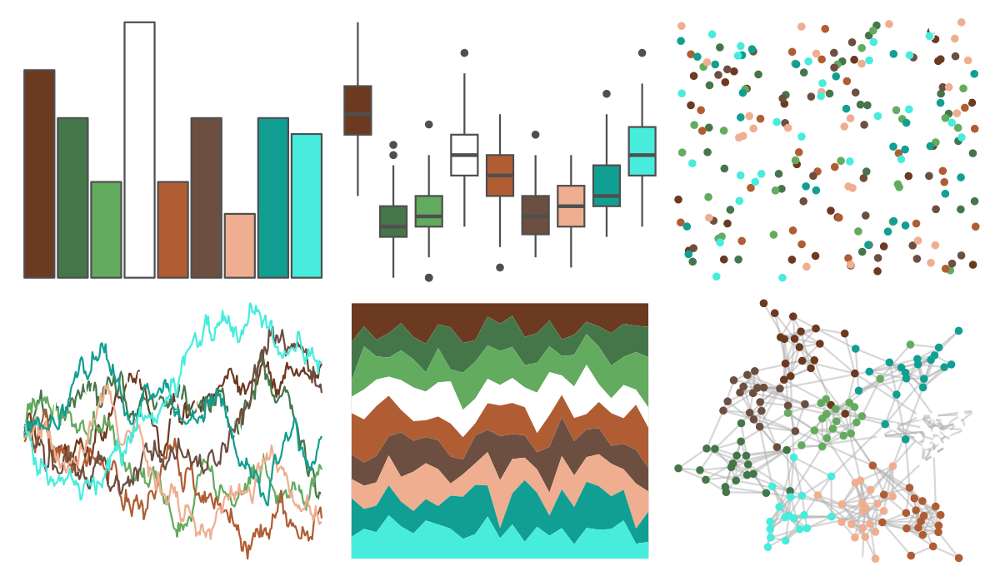

# ggthemr - carrot 

::: columns
::: {.column width="50%"}

**Github**

[Mikata-Project/ggthemr](https://github.com/Mikata-Project/ggthemr)
:::

::: {.column width="50%"}

**CRAN**

Not on CRAN
:::
:::

<hr> 

Use with [paletteer](https://emilhvitfeldt.github.io/paletteer/) package:

```r
library(paletteer)
paletteer_d("ggthemr::carrot")
```

Use raw:

```r
c("#6C3921FF", "#45764AFF", "#63AB5EFF", "#FFFFFFFF", "#B05D34FF", "#6C4F41FF", "#EFAE90FF", "#109F92FF", "#47ECDDFF")
``` 

 

<br>

# Related Palettes

<div class="list" style="display: grid; grid-template-columns: auto auto auto;"> <figure class="figure">
<a href="../../awtools/a_palette/"> </a>
</figure> <figure class="figure">
<a href="../../RColorBrewer/BrBG/"> </a>
</figure> <figure class="figure">
<a href="../../palettetown/larvitar/"> </a>
</figure> <figure class="figure">
<a href="../../ggthemes/fivethirtyeight/"> </a>
</figure> <figure class="figure">
<a href="../../ggthemr/dust/"> </a>
</figure> <figure class="figure">
<a href="../../Redmonder/dPBIRdGn/"> </a>
</figure> <figure class="figure">
<a href="../../palettetown/ivysaur/"> </a>
</figure> <figure class="figure">
<a href="../../palettetown/squirtle/"> </a>
</figure> <figure class="figure">
<a href="../../futurevisions/earth/"> </a>
</figure> <figure class="figure">
<a href="../../palettetown/bulbasaur/"> </a>
</figure> <figure class="figure">
<a href="../../lisa/MarcelDuchamp/"> </a>
</figure> <figure class="figure">
<a href="../../nbapalettes/bucks_earned/"> </a>
</figure> 
</div>
