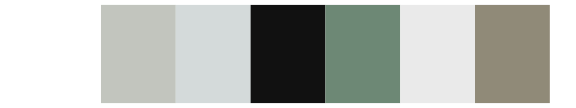
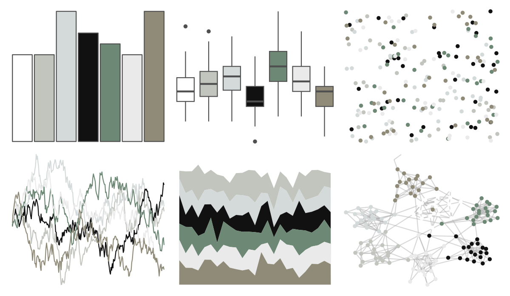

# ggthemr - chalk 

::: columns
::: {.column width="50%"}

**Github**

[Mikata-Project/ggthemr](https://github.com/Mikata-Project/ggthemr)
:::

::: {.column width="50%"}

**CRAN**

Not on CRAN
:::
:::

<hr> 

Use with [paletteer](https://emilhvitfeldt.github.io/paletteer/) package:

```r
library(paletteer)
paletteer_d("ggthemr::chalk")
```

Use raw:

```r
c("#FFFFFFFF", "#C2C5BEFF", "#D4DADAFF", "#111111FF", "#6D8875FF", "#EAEAEAFF", "#908A78FF")
``` 

 

<br>

# Related Palettes

<div class="list" style="display: grid; grid-template-columns: auto auto auto;"> <figure class="figure">
<a href="../../awtools/a_palette/"> </a>
</figure> <figure class="figure">
<a href="../../ButterflyColors/hamadryas_feronia/"> </a>
</figure> <figure class="figure">
<a href="../../ButterflyColors/hamadryas_feronia/"> </a>
</figure> <figure class="figure">
<a href="../../RColorBrewer/Greys/"> </a>
</figure> <figure class="figure">
<a href="../../palettetown/castform/"> </a>
</figure> <figure class="figure">
<a href="../../palettetown/silcoon/"> </a>
</figure> <figure class="figure">
<a href="../../ggprism/black_and_white/"> </a>
</figure> <figure class="figure">
<a href="../../ggsci/grey_material/"> </a>
</figure> <figure class="figure">
<a href="../../ggthemes/stata_mono/"> </a>
</figure> <figure class="figure">
<a href="../../calecopal/coastaldune1/"> </a>
</figure> <figure class="figure">
<a href="../../tayloRswift/reputation/"> </a>
</figure> <figure class="figure">
<a href="../../ochRe/winmar/"> </a>
</figure> 
</div>
