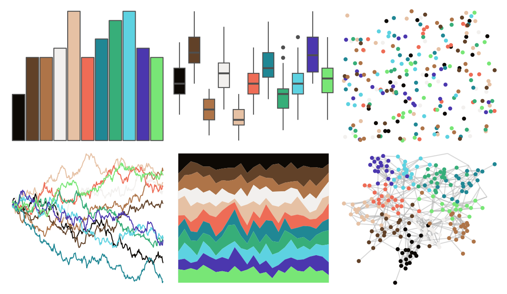

# ggthemr - copper 

::: columns
::: {.column width="50%"}

**Github**

[Mikata-Project/ggthemr](https://github.com/Mikata-Project/ggthemr)
:::

::: {.column width="50%"}

**CRAN**

Not on CRAN
:::
:::

<hr> 

Use with [paletteer](https://emilhvitfeldt.github.io/paletteer/) package:

```r
library(paletteer)
paletteer_d("ggthemr::copper")
```

Use raw:

```r
c("#0D0905FF", "#614128FF", "#AE7448FF", "#F2F0EEFF", "#E6C1A4FF", "#EE6C56FF", "#208794FF", "#37AE79FF", "#5DD2E1FF", "#4B37AEFF", "#78E676FF")
``` 

 

<br>

# Related Palettes

<div class="list" style="display: grid; grid-template-columns: auto auto auto;"> <figure class="figure">
<a href="../../awtools/a_palette/"> </a>
</figure> <figure class="figure">
<a href="../../palettesForR/Android/"> </a>
</figure> <figure class="figure">
<a href="../../peRReo/buenavista/"> </a>
</figure> <figure class="figure">
<a href="../../pals/watlington/"> </a>
</figure> <figure class="figure">
<a href="../../tidyquant/tq_light/"> </a>
</figure> <figure class="figure">
<a href="../../palettetown/seadra/"> </a>
</figure> <figure class="figure">
<a href="../../Redmonder/qMSOSlp/"> </a>
</figure> <figure class="figure">
<a href="../../palettetown/chinchou/"> </a>
</figure> <figure class="figure">
<a href="../../palettetown/manectric/"> </a>
</figure> <figure class="figure">
<a href="../../werpals/benagil/"> </a>
</figure> <figure class="figure">
<a href="../../palettetown/tentacruel/"> </a>
</figure> <figure class="figure">
<a href="../../palettetown/tentacool/"> </a>
</figure> 
</div>
