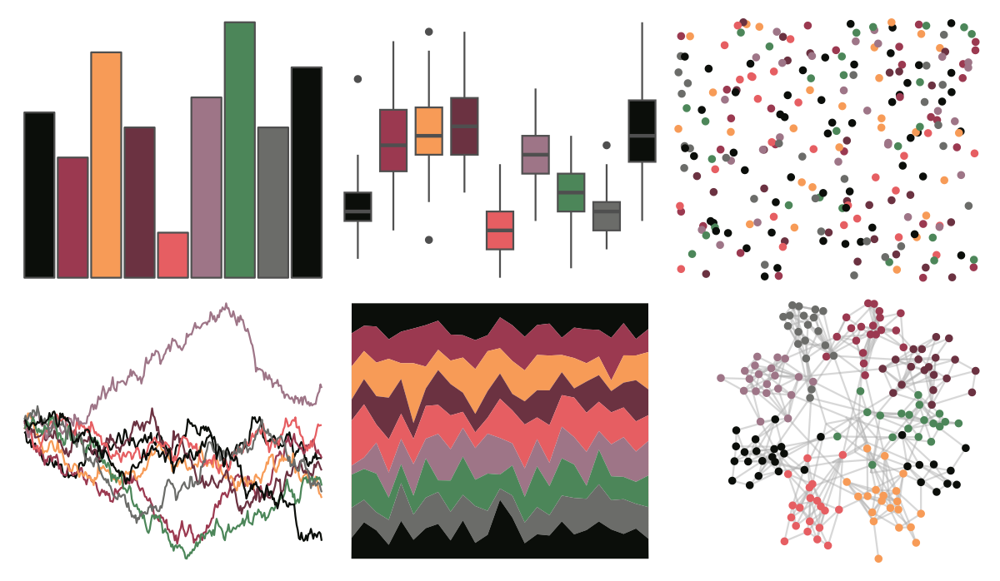

# ggthemr - grape 

::: columns
::: {.column width="50%"}

**Github**

[Mikata-Project/ggthemr](https://github.com/Mikata-Project/ggthemr)
:::

::: {.column width="50%"}

**CRAN**

Not on CRAN
:::
:::

<hr> 

Use with [paletteer](https://emilhvitfeldt.github.io/paletteer/) package:

```r
library(paletteer)
paletteer_d("ggthemr::grape")
```

Use raw:

```r
c("#0B0E0AFF", "#9B3950FF", "#F79B57FF", "#6B3241FF", "#E65E62FF", "#9E7587FF", "#4C8659FF", "#6B6C69FF", "#0B0E0AFF")
``` 

 

<br>

# Related Palettes

<div class="list" style="display: grid; grid-template-columns: auto auto auto;"> <figure class="figure">
<a href="../../amerika/Dem_Ind_Rep3/"> </a>
</figure> <figure class="figure">
<a href="../../tvthemes/attackOnTitan/"> </a>
</figure> <figure class="figure">
<a href="../../ggsci/default_uchicago/"> </a>
</figure> <figure class="figure">
<a href="../../tvthemes/FireNation/"> </a>
</figure> <figure class="figure">
<a href="../../peRReo/beckyg/"> </a>
</figure> <figure class="figure">
<a href="../../nbapalettes/suns/"> </a>
</figure> <figure class="figure">
<a href="../../ggsci/dark_uchicago/"> </a>
</figure> <figure class="figure">
<a href="../../palettetown/torkoal/"> </a>
</figure> <figure class="figure">
<a href="../../peRReo/don/"> </a>
</figure> <figure class="figure">
<a href="../../ButterflyColors/stalachtis_phlegia_susanna/"> </a>
</figure> <figure class="figure">
<a href="../../peRReo/nicky/"> </a>
</figure> <figure class="figure">
<a href="../../palettetown/whismur/"> </a>
</figure> 
</div>
