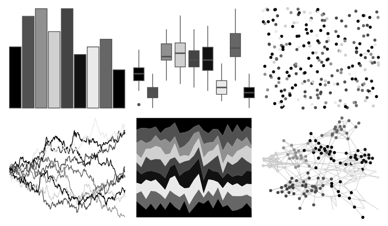

# ggthemr - greyscale 

::: columns
::: {.column width="50%"}

**Github**

[Mikata-Project/ggthemr](https://github.com/Mikata-Project/ggthemr)
:::

::: {.column width="50%"}

**CRAN**

Not on CRAN
:::
:::

<hr> 

Use with [paletteer](https://emilhvitfeldt.github.io/paletteer/) package:

```r
library(paletteer)
paletteer_d("ggthemr::greyscale")
```

Use raw:

```r
c("#000000FF", "#515151FF", "#909090FF", "#D0D0D0FF", "#444444FF", "#111111FF", "#EAEAEAFF", "#666666FF", "#000000FF")
``` 

 

<br>

# Related Palettes

<div class="list" style="display: grid; grid-template-columns: auto auto auto;"> <figure class="figure">
<a href="../../awtools/a_palette/"> </a>
</figure> <figure class="figure">
<a href="../../RColorBrewer/Greys/"> </a>
</figure> <figure class="figure">
<a href="../../tayloRswift/reputation/"> </a>
</figure> <figure class="figure">
<a href="../../ggthemes/stata_mono/"> </a>
</figure> <figure class="figure">
<a href="../../palettetown/silcoon/"> </a>
</figure> <figure class="figure">
<a href="../../lisa/MarkRothko_1/"> </a>
</figure> <figure class="figure">
<a href="../../ggprism/black_and_white/"> </a>
</figure> <figure class="figure">
<a href="../../palettetown/castform/"> </a>
</figure> <figure class="figure">
<a href="../../tvthemes/Tully/"> </a>
</figure> <figure class="figure">
<a href="../../palettetown/linoone/"> </a>
</figure> <figure class="figure">
<a href="../../dutchmasters/little_street/"> </a>
</figure> <figure class="figure">
<a href="../../ggthemr/chalk/"> </a>
</figure> 
</div>
