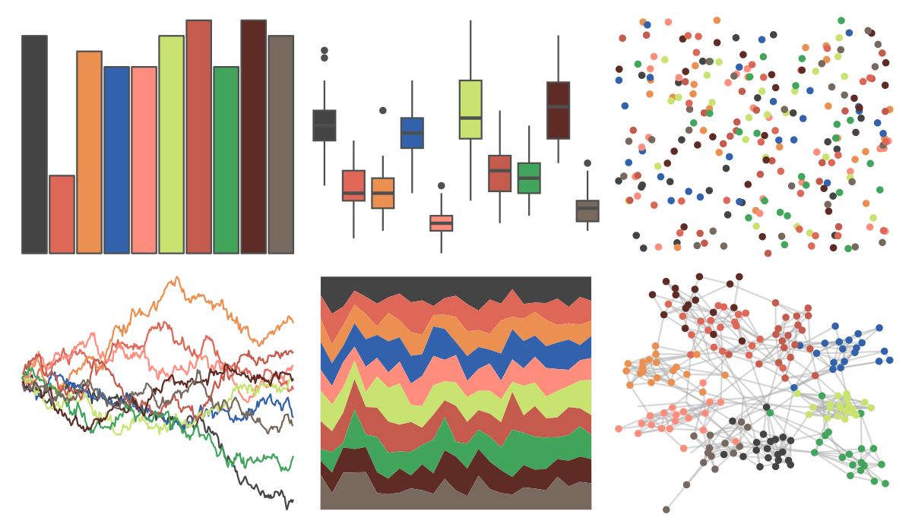

# ggthemr - pale 

::: columns
::: {.column width="50%"}

**Github**

[Mikata-Project/ggthemr](https://github.com/Mikata-Project/ggthemr)
:::

::: {.column width="50%"}

**CRAN**

Not on CRAN
:::
:::

<hr> 

Use with [paletteer](https://emilhvitfeldt.github.io/paletteer/) package:

```r
library(paletteer)
paletteer_d("ggthemr::pale")
```

Use raw:

```r
c("#444444FF", "#DE6757FF", "#EB9050FF", "#3262ABFF", "#FF8D7DFF", "#C8E370FF", "#C45B4DFF", "#41A65CFF", "#5E2C25FF", "#78695FFF")
``` 

 

<br>

# Related Palettes

<div class="list" style="display: grid; grid-template-columns: auto auto auto;"> <figure class="figure">
<a href="../../awtools/a_palette/"> </a>
</figure> <figure class="figure">
<a href="../../futurevisions/pegasi/"> </a>
</figure> <figure class="figure">
<a href="../../miscpalettes/brightPastel/"> </a>
</figure> <figure class="figure">
<a href="../../ggsci/light_uchicago/"> </a>
</figure> <figure class="figure">
<a href="../../ggthemr/light/"> </a>
</figure> <figure class="figure">
<a href="../../MetBrewer/Demuth/"> </a>
</figure> <figure class="figure">
<a href="../../MetBrewer/Signac/"> </a>
</figure> <figure class="figure">
<a href="../../Redmonder/qMSOAsp/"> </a>
</figure> <figure class="figure">
<a href="../../werpals/jozi/"> </a>
</figure> <figure class="figure">
<a href="../../ggthemr/earth/"> </a>
</figure> <figure class="figure">
<a href="../../palettetown/cyndaquil/"> </a>
</figure> <figure class="figure">
<a href="../../ochRe/olsen_seq/"> </a>
</figure> 
</div>
