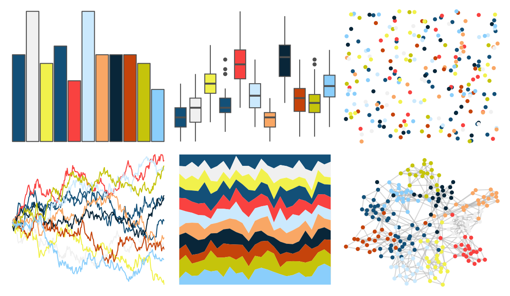

# ggthemr - sea 

::: columns
::: {.column width="50%"}

**Github**

[Mikata-Project/ggthemr](https://github.com/Mikata-Project/ggthemr)
:::

::: {.column width="50%"}

**CRAN**

Not on CRAN
:::
:::

<hr> 

Use with [paletteer](https://emilhvitfeldt.github.io/paletteer/) package:

```r
library(paletteer)
paletteer_d("ggthemr::sea")
```

Use raw:

```r
c("#135078FF", "#F0F0F0FF", "#F1F14CFF", "#135078FF", "#F94240FF", "#CBE9FDFF", "#F9A765FF", "#092639FF", "#C5430BFF", "#C5C40BFF", "#8ACEFBFF")
``` 

 

<br>

# Related Palettes

<div class="list" style="display: grid; grid-template-columns: auto auto auto;"> <figure class="figure">
<a href="../../amerika/Dem_Ind_Rep3/"> </a>
</figure> <figure class="figure">
<a href="../../palettetown/cyndaquil/"> </a>
</figure> <figure class="figure">
<a href="../../palettetown/typhlosion/"> </a>
</figure> <figure class="figure">
<a href="../../palettetown/quilava/"> </a>
</figure> <figure class="figure">
<a href="../../palettetown/ledian/"> </a>
</figure> <figure class="figure">
<a href="../../palettetown/chinchou/"> </a>
</figure> <figure class="figure">
<a href="../../palettetown/minun/"> </a>
</figure> <figure class="figure">
<a href="../../palettetown/lanturn/"> </a>
</figure> <figure class="figure">
<a href="../../werpals/benagil/"> </a>
</figure> <figure class="figure">
<a href="../../miscpalettes/brightPastel/"> </a>
</figure> <figure class="figure">
<a href="../../palettetown/feraligatr/"> </a>
</figure> <figure class="figure">
<a href="../../werpals/okavango/"> </a>
</figure> 
</div>
