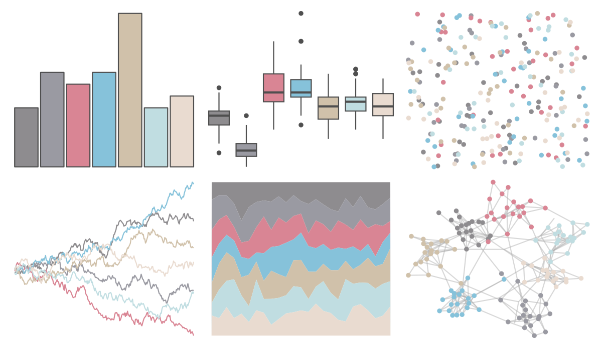
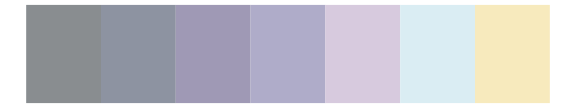

# ghibli - KikiLight 

::: columns
::: {.column width="50%"}

**Github**

[ewenme/ghibli](https://github.com/ewenme/ghibli)
:::

::: {.column width="50%"}

**CRAN**

[ghibli](https://CRAN.R-project.org/package=ghibli)
:::
:::

<hr> 

Use with [paletteer](https://emilhvitfeldt.github.io/paletteer/) package:

```r
library(paletteer)
paletteer_d("ghibli::KikiLight")
```

Use raw:

```r
c("#8E8C8FFF", "#9A9AA2FF", "#D98594FF", "#86C2DAFF", "#D0C1AAFF", "#C0DDE1FF", "#E9DBD0FF")
``` 

 

<br>

# Related Palettes

<div class="list" style="display: grid; grid-template-columns: auto auto auto;"> <figure class="figure">
<a href="../../amerika/Dem_Ind_Rep3/"> </a>
</figure> <figure class="figure">
<a href="../../ghibli/MarnieLight1/"> </a>
</figure> <figure class="figure">
<a href="../../ghibli/SpiritedLight/"> </a>
</figure> <figure class="figure">
<a href="../../ghibli/PonyoLight/"> </a>
</figure> <figure class="figure">
<a href="../../ghibli/LaputaLight/"> </a>
</figure> <figure class="figure">
<a href="../../beyonce/X50/"> </a>
</figure> <figure class="figure">
<a href="../../calecopal/chaparral2/"> </a>
</figure> <figure class="figure">
<a href="../../ghibli/TotoroLight/"> </a>
</figure> <figure class="figure">
<a href="../../ghibli/MononokeLight/"> </a>
</figure> <figure class="figure">
<a href="../../musculusColors/ErFluke/"> </a>
</figure> <figure class="figure">
<a href="../../nationalparkcolors/BryceCanyon/"> </a>
</figure> <figure class="figure">
<a href="../../Rdune/atreides4/"> </a>
</figure> 
</div>
