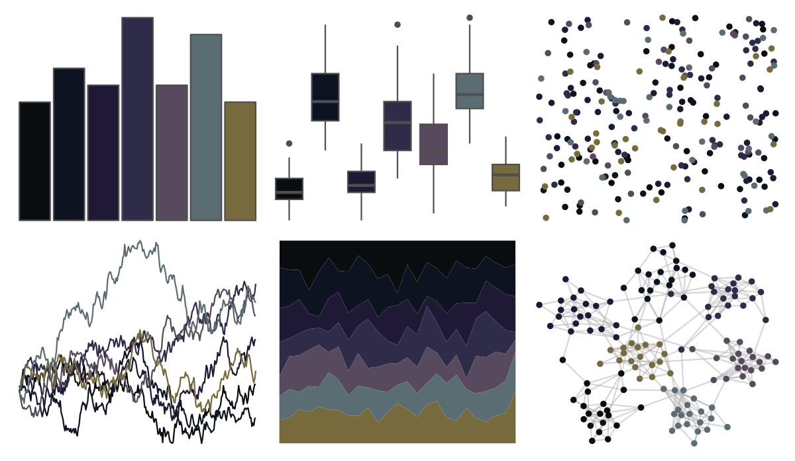

# ghibli - LaputaDark 

::: columns
::: {.column width="50%"}

**Github**

[ewenme/ghibli](https://github.com/ewenme/ghibli)
:::

::: {.column width="50%"}

**CRAN**

[ghibli](https://CRAN.R-project.org/package=ghibli)
:::
:::

<hr> 

Use with [paletteer](https://emilhvitfeldt.github.io/paletteer/) package:

```r
library(paletteer)
paletteer_d("ghibli::LaputaDark")
```

Use raw:

```r
c("#090D10FF", "#0D1321FF", "#1F1935FF", "#2F2C49FF", "#574A5EFF", "#5A6D73FF", "#776A3DFF")
``` 

 

<br>

# Related Palettes

<div class="list" style="display: grid; grid-template-columns: auto auto auto;"> <figure class="figure">
<a href="../../amerika/Dem_Ind_Rep3/"> </a>
</figure> <figure class="figure">
<a href="../../ghibli/SpiritedDark/"> </a>
</figure> <figure class="figure">
<a href="../../ghibli/YesterdayDark/"> </a>
</figure> <figure class="figure">
<a href="../../beyonce/X53/"> </a>
</figure> <figure class="figure">
<a href="../../ghibli/KikiDark/"> </a>
</figure> <figure class="figure">
<a href="../../beyonce/X84/"> </a>
</figure> <figure class="figure">
<a href="../../ghibli/PonyoDark/"> </a>
</figure> <figure class="figure">
<a href="../../beyonce/X124/"> </a>
</figure> <figure class="figure">
<a href="../../Rdune/atreides/"> </a>
</figure> <figure class="figure">
<a href="../../ghibli/MarnieDark1/"> </a>
</figure> <figure class="figure">
<a href="../../beyonce/X68/"> </a>
</figure> <figure class="figure">
<a href="../../beyonce/X31/"> </a>
</figure> 
</div>
