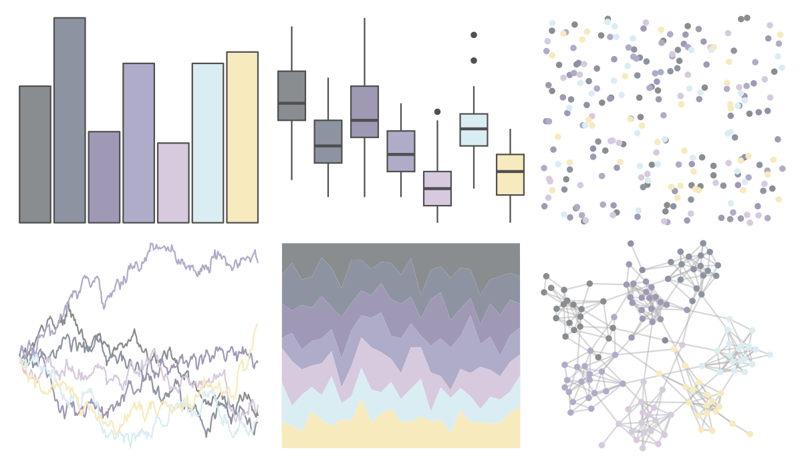

# ghibli - LaputaLight 

::: columns
::: {.column width="50%"}

**Github**

[ewenme/ghibli](https://github.com/ewenme/ghibli)
:::

::: {.column width="50%"}

**CRAN**

[ghibli](https://CRAN.R-project.org/package=ghibli)
:::
:::

<hr> 

Use with [paletteer](https://emilhvitfeldt.github.io/paletteer/) package:

```r
library(paletteer)
paletteer_d("ghibli::LaputaLight")
```

Use raw:

```r
c("#898D90FF", "#8D93A1FF", "#9F99B5FF", "#AFACC9FF", "#D7CADEFF", "#DAEDF3FF", "#F7EABDFF")
``` 

 

<br>

# Related Palettes

<div class="list" style="display: grid; grid-template-columns: auto auto auto;"> <figure class="figure">
<a href="../../amerika/Dem_Ind_Rep3/"> </a>
</figure> <figure class="figure">
<a href="../../ghibli/SpiritedLight/"> </a>
</figure> <figure class="figure">
<a href="../../ghibli/YesterdayLight/"> </a>
</figure> <figure class="figure">
<a href="../../ghibli/MarnieLight1/"> </a>
</figure> <figure class="figure">
<a href="../../ghibli/KikiLight/"> </a>
</figure> <figure class="figure">
<a href="../../fishualize/Harengula_jaguana/"> </a>
</figure> <figure class="figure">
<a href="../../ghibli/MononokeLight/"> </a>
</figure> <figure class="figure">
<a href="../../ghibli/PonyoLight/"> </a>
</figure> <figure class="figure">
<a href="../../nord/afternoon_prarie/"> </a>
</figure> <figure class="figure">
<a href="../../PrettyCols/Winter/"> </a>
</figure> <figure class="figure">
<a href="../../fishualize/Sardinella_brasiliensis/"> </a>
</figure> <figure class="figure">
<a href="../../calecopal/collinsia/"> </a>
</figure> 
</div>
