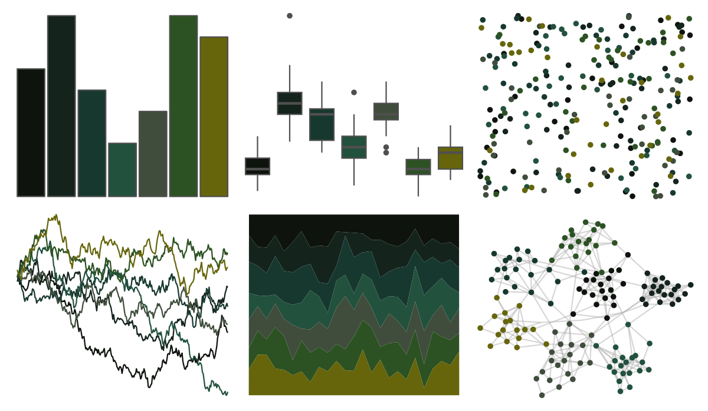

# ghibli - MarnieDark2 

::: columns
::: {.column width="50%"}

**Github**

[ewenme/ghibli](https://github.com/ewenme/ghibli)
:::

::: {.column width="50%"}

**CRAN**

[ghibli](https://CRAN.R-project.org/package=ghibli)
:::
:::

<hr> 

Use with [paletteer](https://emilhvitfeldt.github.io/paletteer/) package:

```r
library(paletteer)
paletteer_d("ghibli::MarnieDark2")
```

Use raw:

```r
c("#0E130DFF", "#14231CFF", "#17382FFF", "#22513DFF", "#404D3CFF", "#2C5223FF", "#66650BFF")
``` 

 

<br>

# Related Palettes

<div class="list" style="display: grid; grid-template-columns: auto auto auto;"> <figure class="figure">
<a href="../../amerika/Dem_Ind_Rep3/"> </a>
</figure> <figure class="figure">
<a href="../../yarrr/evildead/"> </a>
</figure> <figure class="figure">
<a href="../../ghibli/MononokeDark/"> </a>
</figure> <figure class="figure">
<a href="../../colRoz/daintree/"> </a>
</figure> <figure class="figure">
<a href="../../ggprism/earth_tones/"> </a>
</figure> <figure class="figure">
<a href="../../colRoz/c_australasiae/"> </a>
</figure> <figure class="figure">
<a href="../../khroma/dark/"> </a>
</figure> <figure class="figure">
<a href="../../ghibli/TotoroDark/"> </a>
</figure> <figure class="figure">
<a href="../../ghibli/YesterdayDark/"> </a>
</figure> <figure class="figure">
<a href="../../ghibli/MarnieDark1/"> </a>
</figure> <figure class="figure">
<a href="../../ghibli/PonyoDark/"> </a>
</figure> <figure class="figure">
<a href="../../ghibli/KikiDark/"> </a>
</figure> 
</div>
