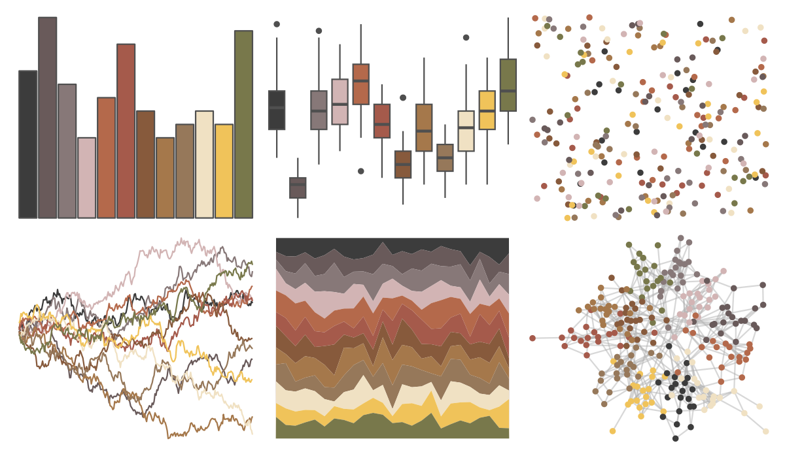

# impressionist.colors - chanteuse_de_cafe_concert 

::: columns
::: {.column width="50%"}

**Github**

Not on Github
:::

::: {.column width="50%"}

**CRAN**

[impressionist.colors](https://CRAN.R-project.org/package=impressionist.colors)
:::
:::

<hr> 

Use with [paletteer](https://emilhvitfeldt.github.io/paletteer/) package:

```r
library(paletteer)
paletteer_d("impressionist.colors::chanteuse_de_cafe_concert")
```

Use raw:

```r
c("#3C3C3CFF", "#695A5AFF", "#877878FF", "#D2B4B4FF", "#B4694BFF", "#A55A4BFF", "#875A3CFF", "#A5784BFF", "#96785AFF", "#F0E1C3FF", "#F0C35AFF", "#78784BFF")
``` 

 

<br>

# Related Palettes

<div class="list" style="display: grid; grid-template-columns: auto auto auto;"> <figure class="figure">
<a href="../../awtools/a_palette/"> </a>
</figure> <figure class="figure">
<a href="../../trekcolors/iconian/"> </a>
</figure> <figure class="figure">
<a href="../../palettetown/lunatone/"> </a>
</figure> <figure class="figure">
<a href="../../feathers/oriole/"> </a>
</figure> <figure class="figure">
<a href="../../palettetown/hitmonchan/"> </a>
</figure> <figure class="figure">
<a href="../../palettetown/skarmory/"> </a>
</figure> <figure class="figure">
<a href="../../palettetown/magcargo/"> </a>
</figure> <figure class="figure">
<a href="../../palettetown/spinda/"> </a>
</figure> <figure class="figure">
<a href="../../palettetown/houndoom/"> </a>
</figure> <figure class="figure">
<a href="../../palettetown/houndour/"> </a>
</figure> <figure class="figure">
<a href="../../palettetown/rhydon/"> </a>
</figure> <figure class="figure">
<a href="../../palettetown/umbreon/"> </a>
</figure> 
</div>
