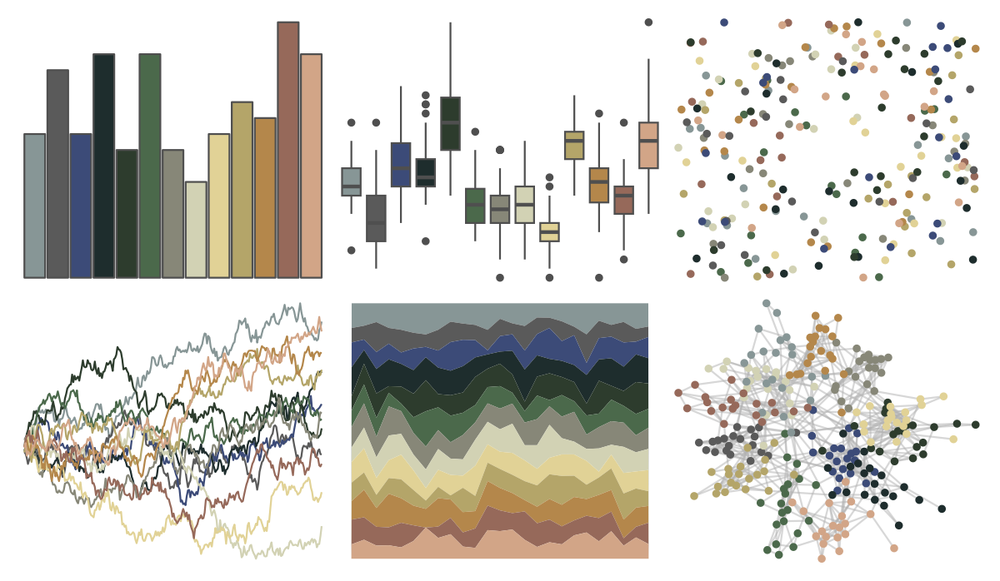

# impressionist.colors - dans_la_serre 

::: columns
::: {.column width="50%"}

**Github**

Not on Github
:::

::: {.column width="50%"}

**CRAN**

[impressionist.colors](https://CRAN.R-project.org/package=impressionist.colors)
:::
:::

<hr> 

Use with [paletteer](https://emilhvitfeldt.github.io/paletteer/) package:

```r
library(paletteer)
paletteer_d("impressionist.colors::dans_la_serre")
```

Use raw:

```r
c("#879696FF", "#5A5A5AFF", "#3C4B78FF", "#1E2D2DFF", "#2D3C2DFF", "#4B694BFF", "#878778FF", "#D2D2B4FF", "#E1D296FF", "#B4A569FF", "#B4874BFF", "#96695AFF", "#D2A587FF")
``` 

 

<br>

# Related Palettes

<div class="list" style="display: grid; grid-template-columns: auto auto auto;"> <figure class="figure">
<a href="../../amerika/Dem_Ind_Rep3/"> </a>
</figure> <figure class="figure">
<a href="../../impressionist.colors/la_recolte_des_foins_eragny/"> </a>
</figure> <figure class="figure">
<a href="../../impressionist.colors/un_dimanche_apres_midi_a_l_ile_de_la_grande_jatte/"> </a>
</figure> <figure class="figure">
<a href="../../impressionist.colors/bouilloire_et_fruits/"> </a>
</figure> <figure class="figure">
<a href="../../impressionist.colors/les_nympheas/"> </a>
</figure> <figure class="figure">
<a href="../../impressionist.colors/fleurs_dans_un_vase_de_cristal/"> </a>
</figure> <figure class="figure">
<a href="../../impressionist.colors/lestaque_aux_toits_rouges/"> </a>
</figure> <figure class="figure">
<a href="../../IslamicArt/damascus/"> </a>
</figure> <figure class="figure">
<a href="../../beyonce/X82/"> </a>
</figure> <figure class="figure">
<a href="../../impressionist.colors/la_yole/"> </a>
</figure> <figure class="figure">
<a href="../../MoMAColors/Dali/"> </a>
</figure> <figure class="figure">
<a href="../../impressionist.colors/les_terrassiers/"> </a>
</figure> 
</div>
