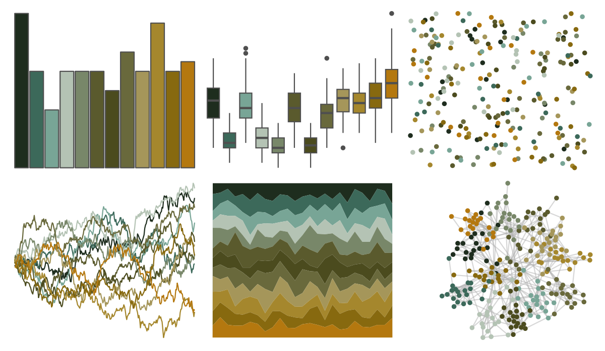

# impressionist.colors - danseuses_a_la_barre 

::: columns
::: {.column width="50%"}

**Github**

Not on Github
:::

::: {.column width="50%"}

**CRAN**

[impressionist.colors](https://CRAN.R-project.org/package=impressionist.colors)
:::
:::

<hr> 

Use with [paletteer](https://emilhvitfeldt.github.io/paletteer/) package:

```r
library(paletteer)
paletteer_d("impressionist.colors::danseuses_a_la_barre")
```

Use raw:

```r
c("#1E2D1EFF", "#3C695AFF", "#78A596FF", "#B4C3B4FF", "#788769FF", "#5A5A2DFF", "#4B4B1EFF", "#69693CFF", "#A5965AFF", "#A5872DFF", "#87690FFF", "#B4780FFF")
``` 

 

<br>

# Related Palettes

<div class="list" style="display: grid; grid-template-columns: auto auto auto;"> <figure class="figure">
<a href="../../amerika/Dem_Ind_Rep3/"> </a>
</figure> <figure class="figure">
<a href="../../impressionist.colors/paysage_tropical_avec_masureset_palmiers/"> </a>
</figure> <figure class="figure">
<a href="../../MexBrewer/Ofrenda/"> </a>
</figure> <figure class="figure">
<a href="../../IslamicArt/fes/"> </a>
</figure> <figure class="figure">
<a href="../../MoMAColors/Dali/"> </a>
</figure> <figure class="figure">
<a href="../../MexBrewer/Tierra/"> </a>
</figure> <figure class="figure">
<a href="../../Manu/Titipounamu/"> </a>
</figure> <figure class="figure">
<a href="../../nord/moose_pond/"> </a>
</figure> <figure class="figure">
<a href="../../tayloRswift/TLOAS/"> </a>
</figure> <figure class="figure">
<a href="../../MetBrewer/Isfahan1/"> </a>
</figure> <figure class="figure">
<a href="../../poisonfrogs/Hhobbsi/"> </a>
</figure> <figure class="figure">
<a href="../../palettetown/golem/"> </a>
</figure> 
</div>
