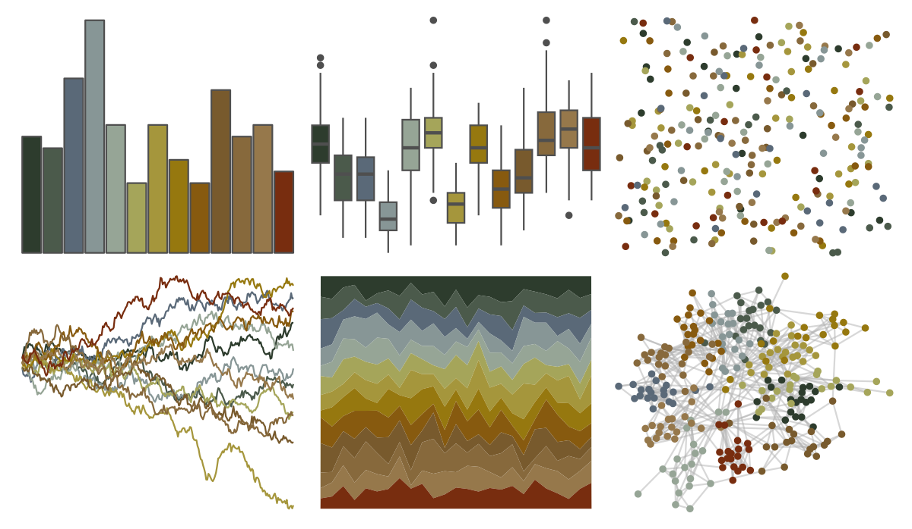

# impressionist.colors - de_slaapkamer 

::: columns
::: {.column width="50%"}

**Github**

Not on Github
:::

::: {.column width="50%"}

**CRAN**

[impressionist.colors](https://CRAN.R-project.org/package=impressionist.colors)
:::
:::

<hr> 

Use with [paletteer](https://emilhvitfeldt.github.io/paletteer/) package:

```r
library(paletteer)
paletteer_d("impressionist.colors::de_slaapkamer")
```

Use raw:

```r
c("#2D3C2DFF", "#4B5A4BFF", "#5A6978FF", "#879696FF", "#96A596FF", "#A5A55AFF", "#A5963CFF", "#96780FFF", "#875A0FFF", "#785A2DFF", "#87693CFF", "#96784BFF", "#782D0FFF")
``` 

 

<br>

# Related Palettes

<div class="list" style="display: grid; grid-template-columns: auto auto auto;"> <figure class="figure">
<a href="../../amerika/Dem_Ind_Rep3/"> </a>
</figure> <figure class="figure">
<a href="../../impressionist.colors/la_yole/"> </a>
</figure> <figure class="figure">
<a href="../../MoMAColors/Dali/"> </a>
</figure> <figure class="figure">
<a href="../../impressionist.colors/la_recolte_des_foins_eragny/"> </a>
</figure> <figure class="figure">
<a href="../../impressionist.colors/lestaque_aux_toits_rouges/"> </a>
</figure> <figure class="figure">
<a href="../../impressionist.colors/les_terrassiers/"> </a>
</figure> <figure class="figure">
<a href="../../impressionist.colors/les_nympheas/"> </a>
</figure> <figure class="figure">
<a href="../../impressionist.colors/dans_la_serre/"> </a>
</figure> <figure class="figure">
<a href="../../impressionist.colors/bouilloire_et_fruits/"> </a>
</figure> <figure class="figure">
<a href="../../rcartocolor/Antique/"> </a>
</figure> <figure class="figure">
<a href="../../NatParksPalettes/Torres/"> </a>
</figure> <figure class="figure">
<a href="../../IslamicArt/damascus/"> </a>
</figure> 
</div>
