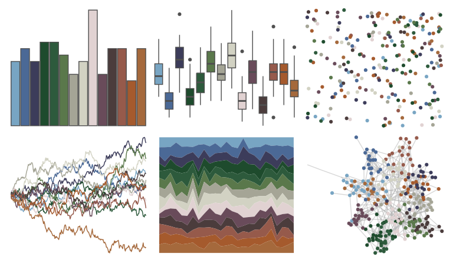

# impressionist.colors - fleurs_dans_un_vase_de_cristal 

::: columns
::: {.column width="50%"}

**Github**

Not on Github
:::

::: {.column width="50%"}

**CRAN**

[impressionist.colors](https://CRAN.R-project.org/package=impressionist.colors)
:::
:::

<hr> 

Use with [paletteer](https://emilhvitfeldt.github.io/paletteer/) package:

```r
library(paletteer)
paletteer_d("impressionist.colors::fleurs_dans_un_vase_de_cristal")
```

Use raw:

```r
c("#78A5C3FF", "#4B6996FF", "#3C3C5AFF", "#1E4B2DFF", "#2D5A3CFF", "#5A784BFF", "#A5A596FF", "#D2D2C3FF", "#E1D2D2FF", "#694B5AFF", "#4B3C3CFF", "#965A4BFF", "#A55A2DFF", "#A5693CFF")
``` 

 

<br>

# Related Palettes

<div class="list" style="display: grid; grid-template-columns: auto auto auto;"> <figure class="figure">
<a href="../../awtools/a_palette/"> </a>
</figure> <figure class="figure">
<a href="../../impressionist.colors/un_dimanche_apres_midi_a_l_ile_de_la_grande_jatte/"> </a>
</figure> <figure class="figure">
<a href="../../impressionist.colors/les_nympheas/"> </a>
</figure> <figure class="figure">
<a href="../../impressionist.colors/la_chanson_du_chien/"> </a>
</figure> <figure class="figure">
<a href="../../impressionist.colors/lestaque_aux_toits_rouges/"> </a>
</figure> <figure class="figure">
<a href="../../impressionist.colors/te_aa_no_areois/"> </a>
</figure> <figure class="figure">
<a href="../../impressionist.colors/les_peupliers/"> </a>
</figure> <figure class="figure">
<a href="../../impressionist.colors/dans_la_serre/"> </a>
</figure> <figure class="figure">
<a href="../../impressionist.colors/la_recolte_des_foins_eragny/"> </a>
</figure> <figure class="figure">
<a href="../../NatParksPalettes/Torres/"> </a>
</figure> <figure class="figure">
<a href="../../dutchmasters/milkmaid/"> </a>
</figure> <figure class="figure">
<a href="../../peRReo/wyy/"> </a>
</figure> 
</div>
