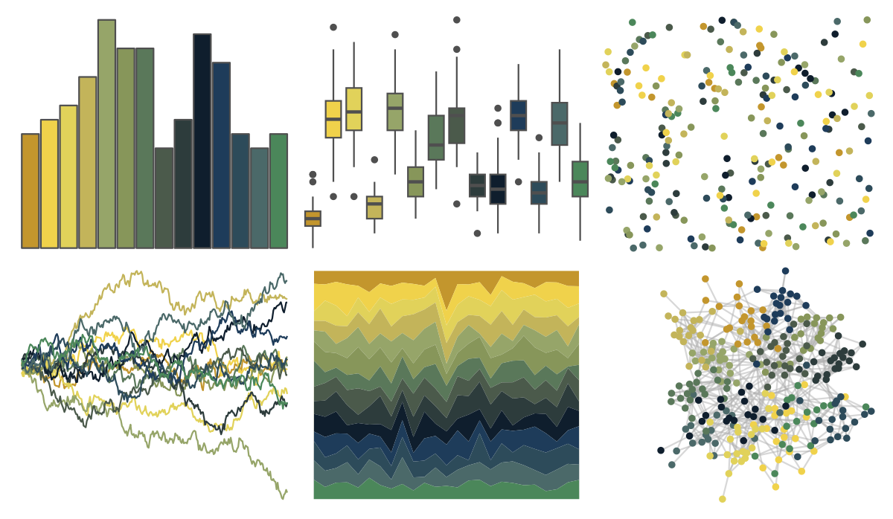
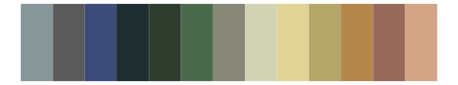

# impressionist.colors - irissen 

::: columns
::: {.column width="50%"}

**Github**

Not on Github
:::

::: {.column width="50%"}

**CRAN**

[impressionist.colors](https://CRAN.R-project.org/package=impressionist.colors)
:::
:::

<hr> 

Use with [paletteer](https://emilhvitfeldt.github.io/paletteer/) package:

```r
library(paletteer)
paletteer_d("impressionist.colors::irissen")
```

Use raw:

```r
c("#C3962DFF", "#F0D24BFF", "#E1D25AFF", "#C3B45AFF", "#96A569FF", "#87965AFF", "#5A785AFF", "#4B5A4BFF", "#2D3C3CFF", "#0F1E2DFF", "#1E3C5AFF", "#2D4B5AFF", "#4B6969FF", "#4B875AFF")
``` 

 

<br>

# Related Palettes

<div class="list" style="display: grid; grid-template-columns: auto auto auto;"> <figure class="figure">
<a href="../../awtools/a_palette/"> </a>
</figure> <figure class="figure">
<a href="../../ButterflyColors/hamadryas_feronia/"> </a>
</figure> <figure class="figure">
<a href="../../ButterflyColors/hamadryas_feronia/"> </a>
</figure> <figure class="figure">
<a href="../../beyonce/X82/"> </a>
</figure> <figure class="figure">
<a href="../../impressionist.colors/la_recolte_des_foins_eragny/"> </a>
</figure> <figure class="figure">
<a href="../../MoMAColors/Dali/"> </a>
</figure> <figure class="figure">
<a href="../../PrettyCols/Summer/"> </a>
</figure> <figure class="figure">
<a href="../../impressionist.colors/korenveld_onder_onweerslucht/"> </a>
</figure> <figure class="figure">
<a href="../../impressionist.colors/la_yole/"> </a>
</figure> <figure class="figure">
<a href="../../impressionist.colors/de_slaapkamer/"> </a>
</figure> <figure class="figure">
<a href="../../dutchmasters/milkmaid/"> </a>
</figure> <figure class="figure">
<a href="../../impressionist.colors/dans_la_serre/"> </a>
</figure> 
</div>
