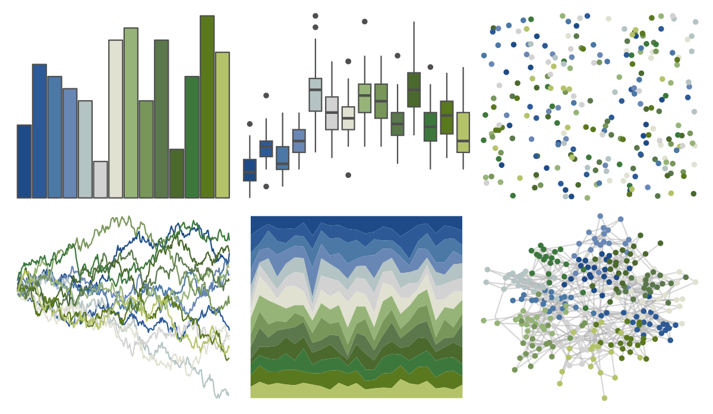
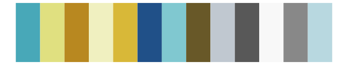

# impressionist.colors - korenveld_onder_onweerslucht 

::: columns
::: {.column width="50%"}

**Github**

Not on Github
:::

::: {.column width="50%"}

**CRAN**

[impressionist.colors](https://CRAN.R-project.org/package=impressionist.colors)
:::
:::

<hr> 

Use with [paletteer](https://emilhvitfeldt.github.io/paletteer/) package:

```r
library(paletteer)
paletteer_d("impressionist.colors::korenveld_onder_onweerslucht")
```

Use raw:

```r
c("#1E4B87FF", "#2D5A96FF", "#4B78A5FF", "#6987B4FF", "#B4C3C3FF", "#D2D2D2FF", "#E1E1D2FF", "#96B478FF", "#78965AFF", "#5A784BFF", "#4B692DFF", "#3C783CFF", "#5A781EFF", "#B4C369FF")
``` 

 

<br>

# Related Palettes

<div class="list" style="display: grid; grid-template-columns: auto auto auto;"> <figure class="figure">
<a href="../../amerika/Dem_Ind_Rep3/"> </a>
</figure> <figure class="figure">
<a href="../../beyonce/X82/"> </a>
</figure> <figure class="figure">
<a href="../../khroma/PRGn/"> </a>
</figure> <figure class="figure">
<a href="../../palettetown/dunsparce/"> </a>
</figure> <figure class="figure">
<a href="../../impressionist.colors/la_recolte_des_foins_eragny/"> </a>
</figure> <figure class="figure">
<a href="../../palettetown/hitmontop/"> </a>
</figure> <figure class="figure">
<a href="../../palettetown/lotad/"> </a>
</figure> <figure class="figure">
<a href="../../palettetown/tyranitar/"> </a>
</figure> <figure class="figure">
<a href="../../palettetown/vaporeon/"> </a>
</figure> <figure class="figure">
<a href="../../MoMAColors/Dali/"> </a>
</figure> <figure class="figure">
<a href="../../colRoz/r_aculeatus/"> </a>
</figure> <figure class="figure">
<a href="../../palettetown/heracross/"> </a>
</figure> 
</div>
