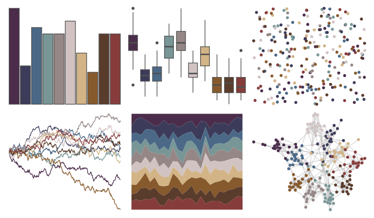

# impressionist.colors - la_chanson_du_chien 

::: columns
::: {.column width="50%"}

**Github**

Not on Github
:::

::: {.column width="50%"}

**CRAN**

[impressionist.colors](https://CRAN.R-project.org/package=impressionist.colors)
:::
:::

<hr> 

Use with [paletteer](https://emilhvitfeldt.github.io/paletteer/) package:

```r
library(paletteer)
paletteer_d("impressionist.colors::la_chanson_du_chien")
```

Use raw:

```r
c("#4B2D4BFF", "#3C3C5AFF", "#4B6987FF", "#789696FF", "#968787FF", "#D2C3C3FF", "#D2B487FF", "#875A2DFF", "#5A3C2DFF", "#873C3CFF")
``` 

 

<br>

# Related Palettes

<div class="list" style="display: grid; grid-template-columns: auto auto auto;"> <figure class="figure">
<a href="../../awtools/a_palette/"> </a>
</figure> <figure class="figure">
<a href="../../peRReo/wyy/"> </a>
</figure> <figure class="figure">
<a href="../../colRoz/salt_lake/"> </a>
</figure> <figure class="figure">
<a href="../../ochRe/parliament/"> </a>
</figure> <figure class="figure">
<a href="../../impressionist.colors/fleurs_dans_un_vase_de_cristal/"> </a>
</figure> <figure class="figure">
<a href="../../nord/halifax_harbor/"> </a>
</figure> <figure class="figure">
<a href="../../calecopal/tidepool/"> </a>
</figure> <figure class="figure">
<a href="../../palettetown/cloyster/"> </a>
</figure> <figure class="figure">
<a href="../../rcartocolor/Antique/"> </a>
</figure> <figure class="figure">
<a href="../../colRoz/t_australis/"> </a>
</figure> <figure class="figure">
<a href="../../impressionist.colors/bouilloire_et_fruits/"> </a>
</figure> <figure class="figure">
<a href="../../impressionist.colors/les_peupliers/"> </a>
</figure> 
</div>
