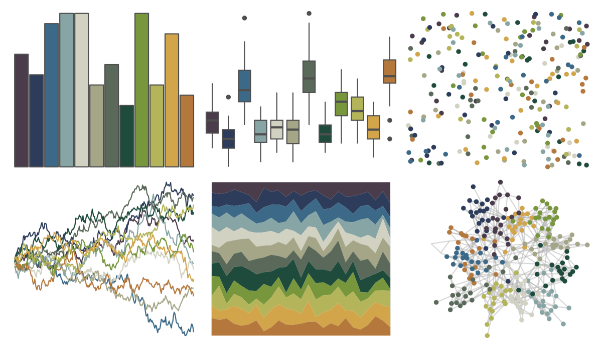

# impressionist.colors - la_recolte_des_foins_eragny 

::: columns
::: {.column width="50%"}

**Github**

Not on Github
:::

::: {.column width="50%"}

**CRAN**

[impressionist.colors](https://CRAN.R-project.org/package=impressionist.colors)
:::
:::

<hr> 

Use with [paletteer](https://emilhvitfeldt.github.io/paletteer/) package:

```r
library(paletteer)
paletteer_d("impressionist.colors::la_recolte_des_foins_eragny")
```

Use raw:

```r
c("#4B3C4BFF", "#2D3C5AFF", "#3C6987FF", "#87A5A5FF", "#D2D2C3FF", "#A5A587FF", "#5A695AFF", "#1E4B3CFF", "#78963CFF", "#B4B45AFF", "#D2A54BFF", "#B4783CFF")
``` 

 

<br>

# Related Palettes

<div class="list" style="display: grid; grid-template-columns: auto auto auto;"> <figure class="figure">
<a href="../../awtools/a_palette/"> </a>
</figure> <figure class="figure">
<a href="../../impressionist.colors/dans_la_serre/"> </a>
</figure> <figure class="figure">
<a href="../../impressionist.colors/un_dimanche_apres_midi_a_l_ile_de_la_grande_jatte/"> </a>
</figure> <figure class="figure">
<a href="../../impressionist.colors/bouilloire_et_fruits/"> </a>
</figure> <figure class="figure">
<a href="../../beyonce/X82/"> </a>
</figure> <figure class="figure">
<a href="../../impressionist.colors/lestaque_aux_toits_rouges/"> </a>
</figure> <figure class="figure">
<a href="../../Manu/Kotare/"> </a>
</figure> <figure class="figure">
<a href="../../impressionist.colors/les_nympheas/"> </a>
</figure> <figure class="figure">
<a href="../../calecopal/bigsur2/"> </a>
</figure> <figure class="figure">
<a href="../../impressionist.colors/fleurs_dans_un_vase_de_cristal/"> </a>
</figure> <figure class="figure">
<a href="../../NatParksPalettes/IguazuFalls/"> </a>
</figure> <figure class="figure">
<a href="../../impressionist.colors/de_slaapkamer/"> </a>
</figure> 
</div>
