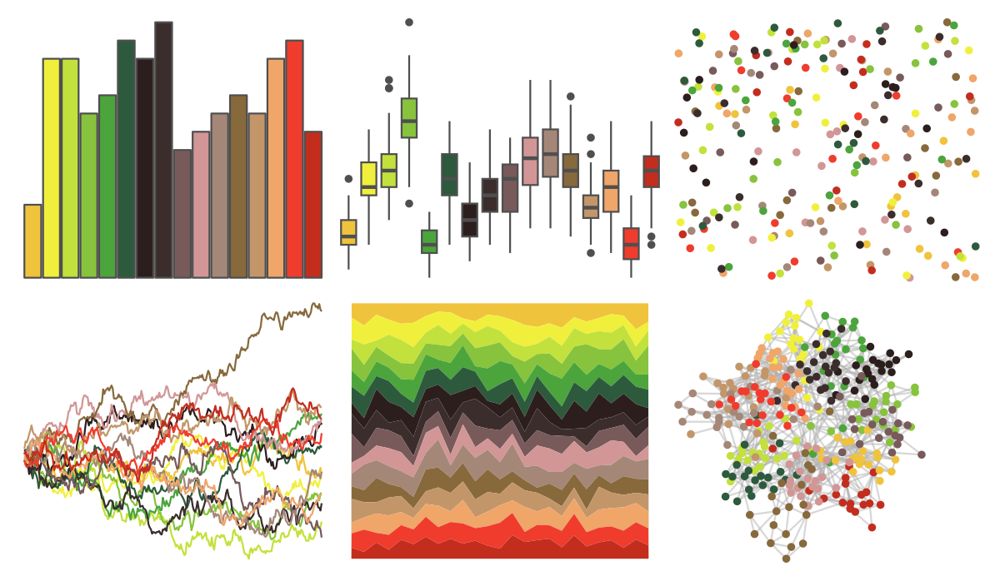
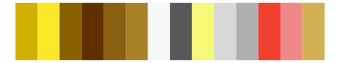

# impressionist.colors - la_sieste 

::: columns
::: {.column width="50%"}

**Github**

Not on Github
:::

::: {.column width="50%"}

**CRAN**

[impressionist.colors](https://CRAN.R-project.org/package=impressionist.colors)
:::
:::

<hr> 

Use with [paletteer](https://emilhvitfeldt.github.io/paletteer/) package:

```r
library(paletteer)
paletteer_d("impressionist.colors::la_sieste")
```

Use raw:

```r
c("#F0C33CFF", "#F0F03CFF", "#C3E13CFF", "#87C33CFF", "#4BA53CFF", "#2D5A3CFF", "#2D1E1EFF", "#3C2D2DFF", "#785A5AFF", "#D29696FF", "#A58778FF", "#87693CFF", "#C39669FF", "#F0A569FF", "#F03C2DFF", "#C32D1EFF")
``` 

 

<br>

# Related Palettes

<div class="list" style="display: grid; grid-template-columns: auto auto auto;"> <figure class="figure">
<a href="../../awtools/a_palette/"> </a>
</figure> <figure class="figure">
<a href="../../palettetown/dustox/"> </a>
</figure> <figure class="figure">
<a href="../../palettetown/natu/"> </a>
</figure> <figure class="figure">
<a href="../../palettetown/cradily/"> </a>
</figure> <figure class="figure">
<a href="../../palettetown/xatu/"> </a>
</figure> <figure class="figure">
<a href="../../palettetown/grovyle/"> </a>
</figure> <figure class="figure">
<a href="../../palettetown/solrock/"> </a>
</figure> <figure class="figure">
<a href="../../palettetown/banette/"> </a>
</figure> <figure class="figure">
<a href="../../palettetown/noctowl/"> </a>
</figure> <figure class="figure">
<a href="../../trekcolors/breen/"> </a>
</figure> <figure class="figure">
<a href="../../palettetown/kadabra/"> </a>
</figure> <figure class="figure">
<a href="../../palettetown/meganium/"> </a>
</figure> 
</div>
