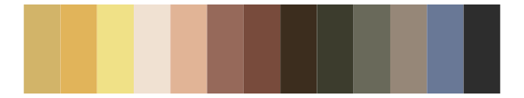
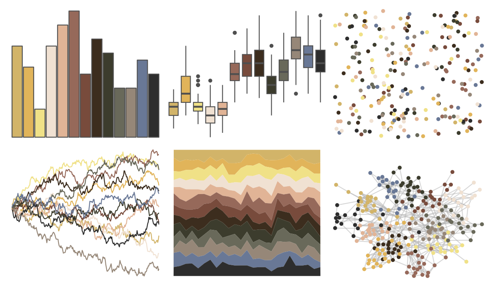
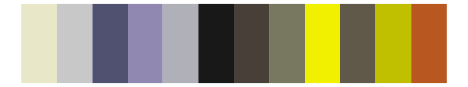

# impressionist.colors - le_dejeuner_des_canotiers 

::: columns
::: {.column width="50%"}

**Github**

Not on Github
:::

::: {.column width="50%"}

**CRAN**

[impressionist.colors](https://CRAN.R-project.org/package=impressionist.colors)
:::
:::

<hr> 

Use with [paletteer](https://emilhvitfeldt.github.io/paletteer/) package:

```r
library(paletteer)
paletteer_d("impressionist.colors::le_dejeuner_des_canotiers")
```

Use raw:

```r
c("#D2B469FF", "#E1B45AFF", "#F0E187FF", "#F0E1D2FF", "#E1B496FF", "#96695AFF", "#784B3CFF", "#3C2D1EFF", "#3C3C2DFF", "#69695AFF", "#968778FF", "#697896FF", "#2D2D2DFF")
``` 

 

<br>

# Related Palettes

<div class="list" style="display: grid; grid-template-columns: auto auto auto;"> <figure class="figure">
<a href="../../awtools/a_palette/"> </a>
</figure> <figure class="figure">
<a href="../../palettetown/hariyama/"> </a>
</figure> <figure class="figure">
<a href="../../impressionist.colors/vahine_no_te_tiare/"> </a>
</figure> <figure class="figure">
<a href="../../werpals/jozi/"> </a>
</figure> <figure class="figure">
<a href="../../dutchmasters/pearl_earring/"> </a>
</figure> <figure class="figure">
<a href="../../ochRe/olsen_seq/"> </a>
</figure> <figure class="figure">
<a href="../../palettetown/camerupt/"> </a>
</figure> <figure class="figure">
<a href="../../palettetown/shelgon/"> </a>
</figure> <figure class="figure">
<a href="../../palettetown/snorlax/"> </a>
</figure> <figure class="figure">
<a href="../../dutchmasters/milkmaid/"> </a>
</figure> <figure class="figure">
<a href="../../ggthemr/pale/"> </a>
</figure> <figure class="figure">
<a href="../../palettetown/linoone/"> </a>
</figure> 
</div>
