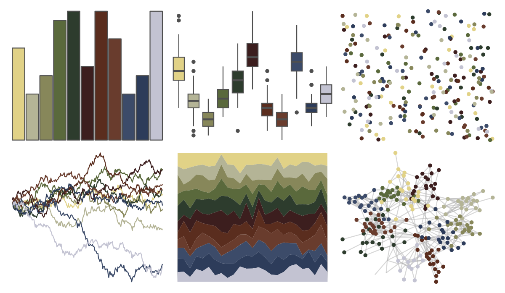

# impressionist.colors - pres_du_lac 

::: columns
::: {.column width="50%"}

**Github**

Not on Github
:::

::: {.column width="50%"}

**CRAN**

[impressionist.colors](https://CRAN.R-project.org/package=impressionist.colors)
:::
:::

<hr> 

Use with [paletteer](https://emilhvitfeldt.github.io/paletteer/) package:

```r
library(paletteer)
paletteer_d("impressionist.colors::pres_du_lac")
```

Use raw:

```r
c("#E1D287FF", "#B4B496FF", "#87875AFF", "#5A693CFF", "#2D3C2DFF", "#3C1E1EFF", "#5A2D1EFF", "#693C2DFF", "#3C4B69FF", "#2D3C5AFF", "#C3C3D2FF")
``` 

 

<br>

# Related Palettes

<div class="list" style="display: grid; grid-template-columns: auto auto auto;"> <figure class="figure">
<a href="../../awtools/a_palette/"> </a>
</figure> <figure class="figure">
<a href="../../ButterflyColors/hamadryas_feronia/"> </a>
</figure> <figure class="figure">
<a href="../../ButterflyColors/hamadryas_feronia/"> </a>
</figure> <figure class="figure">
<a href="../../MoMAColors/Kippenberger/"> </a>
</figure> <figure class="figure">
<a href="../../impressionist.colors/vahine_no_te_tiare/"> </a>
</figure> <figure class="figure">
<a href="../../palettetown/linoone/"> </a>
</figure> <figure class="figure">
<a href="../../dutchmasters/milkmaid/"> </a>
</figure> <figure class="figure">
<a href="../../palettetown/wynaut/"> </a>
</figure> <figure class="figure">
<a href="../../peRReo/buenavista/"> </a>
</figure> <figure class="figure">
<a href="../../impressionist.colors/dans_la_serre/"> </a>
</figure> <figure class="figure">
<a href="../../palettetown/wailmer/"> </a>
</figure> <figure class="figure">
<a href="../../MoMAColors/Levine1/"> </a>
</figure> 
</div>
