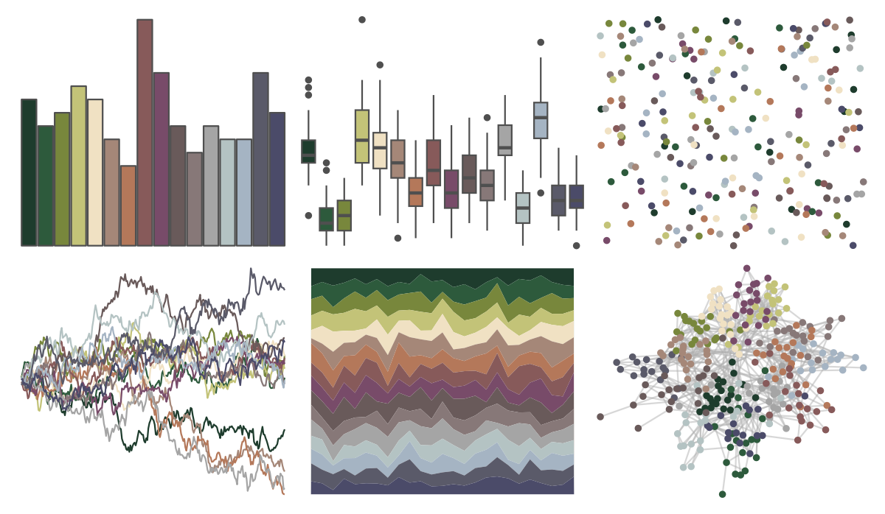

# impressionist.colors - un_dimanche_apres_midi_a_l_ile_de_la_grande_jatte 

::: columns
::: {.column width="50%"}

**Github**

Not on Github
:::

::: {.column width="50%"}

**CRAN**

[impressionist.colors](https://CRAN.R-project.org/package=impressionist.colors)
:::
:::

<hr> 

Use with [paletteer](https://emilhvitfeldt.github.io/paletteer/) package:

```r
library(paletteer)
paletteer_d("impressionist.colors::un_dimanche_apres_midi_a_l_ile_de_la_grande_jatte")
```

Use raw:

```r
c("#1E3C2DFF", "#2D5A3CFF", "#78873CFF", "#C3C378FF", "#F0E1C3FF", "#A58778FF", "#B4785AFF", "#875A5AFF", "#784B69FF", "#695A5AFF", "#877878FF", "#A5A5A5FF", "#B4C3C3FF", "#A5B4C3FF", "#5A5A69FF", "#4B4B69FF")
``` 

 

<br>

# Related Palettes

<div class="list" style="display: grid; grid-template-columns: auto auto auto;"> <figure class="figure">
<a href="../../awtools/a_palette/"> </a>
</figure> <figure class="figure">
<a href="../../ButterflyColors/hamadryas_feronia/"> </a>
</figure> <figure class="figure">
<a href="../../ButterflyColors/hamadryas_feronia/"> </a>
</figure> <figure class="figure">
<a href="../../impressionist.colors/dans_la_serre/"> </a>
</figure> <figure class="figure">
<a href="../../impressionist.colors/fleurs_dans_un_vase_de_cristal/"> </a>
</figure> <figure class="figure">
<a href="../../impressionist.colors/les_nympheas/"> </a>
</figure> <figure class="figure">
<a href="../../impressionist.colors/la_recolte_des_foins_eragny/"> </a>
</figure> <figure class="figure">
<a href="../../palettetown/rattata/"> </a>
</figure> <figure class="figure">
<a href="../../impressionist.colors/les_peupliers/"> </a>
</figure> <figure class="figure">
<a href="../../palettetown/butterfree/"> </a>
</figure> <figure class="figure">
<a href="../../MoMAColors/Picabia/"> </a>
</figure> <figure class="figure">
<a href="../../palettetown/donphan/"> </a>
</figure> 
</div>
