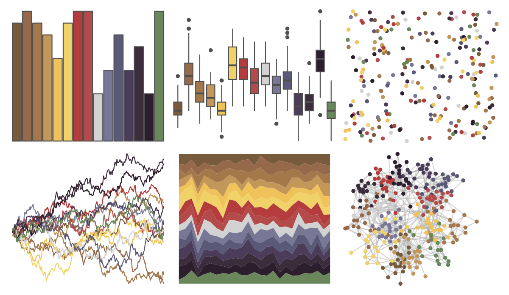

# impressionist.colors - vahine_no_te_tiare 

::: columns
::: {.column width="50%"}

**Github**

Not on Github
:::

::: {.column width="50%"}

**CRAN**

[impressionist.colors](https://CRAN.R-project.org/package=impressionist.colors)
:::
:::

<hr> 

Use with [paletteer](https://emilhvitfeldt.github.io/paletteer/) package:

```r
library(paletteer)
paletteer_d("impressionist.colors::vahine_no_te_tiare")
```

Use raw:

```r
c("#785A3CFF", "#96694BFF", "#A5784BFF", "#C3965AFF", "#F0C35AFF", "#F0D269FF", "#B43C3CFF", "#B44B4BFF", "#D2D2D2FF", "#787896FF", "#5A5A78FF", "#4B3C5AFF", "#3C2D3CFF", "#2D1E2DFF", "#69875AFF")
``` 

 

<br>

# Related Palettes

<div class="list" style="display: grid; grid-template-columns: auto auto auto;"> <figure class="figure">
<a href="../../amerika/Dem_Ind_Rep3/"> </a>
</figure> <figure class="figure">
<a href="../../palettetown/volbeat/"> </a>
</figure> <figure class="figure">
<a href="../../ochRe/olsen_seq/"> </a>
</figure> <figure class="figure">
<a href="../../palettetown/miltank/"> </a>
</figure> <figure class="figure">
<a href="../../palettetown/makuhita/"> </a>
</figure> <figure class="figure">
<a href="../../palettetown/spoink/"> </a>
</figure> <figure class="figure">
<a href="../../palettetown/blaziken/"> </a>
</figure> <figure class="figure">
<a href="../../impressionist.colors/le_dejeuner_des_canotiers/"> </a>
</figure> <figure class="figure">
<a href="../../dutchmasters/milkmaid/"> </a>
</figure> <figure class="figure">
<a href="../../palettetown/shelgon/"> </a>
</figure> <figure class="figure">
<a href="../../palettetown/snorunt/"> </a>
</figure> <figure class="figure">
<a href="../../palettetown/feebas/"> </a>
</figure> 
</div>
