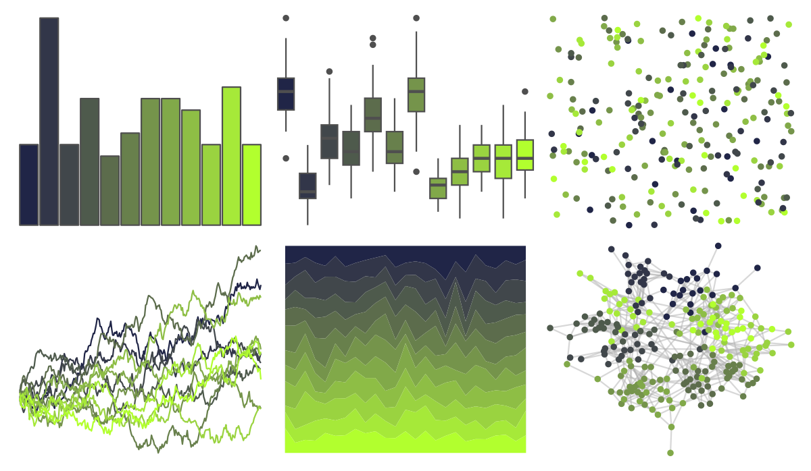

# jcolors - pal11 

::: columns
::: {.column width="50%"}

**Github**

[jaredhuling/jcolors](https://github.com/jaredhuling/jcolors)
:::

::: {.column width="50%"}

**CRAN**

Not on CRAN
:::
:::

<hr> 

Use with [paletteer](https://emilhvitfeldt.github.io/paletteer/) package:

```r
library(paletteer)
paletteer_d("jcolors::pal11")
```

Use raw:

```r
c("#202547FF", "#323649FF", "#41474BFF", "#4E5A4CFF", "#5C6C4CFF", "#68804CFF", "#75944BFF", "#81A949FF", "#8EBE45FF", "#9AD340FF", "#A6E939FF", "#B2FF2EFF")
``` 

 

<br>

# Related Palettes

<div class="list" style="display: grid; grid-template-columns: auto auto auto;"> <figure class="figure">
<a href="../../awtools/a_palette/"> </a>
</figure> <figure class="figure">
<a href="../../ButterflyColors/hamadryas_feronia/"> </a>
</figure> <figure class="figure">
<a href="../../ButterflyColors/hamadryas_feronia/"> </a>
</figure> <figure class="figure">
<a href="../../beyonce/X22/"> </a>
</figure> <figure class="figure">
<a href="../../jcolors/pal10/"> </a>
</figure> <figure class="figure">
<a href="../../PNWColors/Cascades/"> </a>
</figure> <figure class="figure">
<a href="../../palettetown/lotad/"> </a>
</figure> <figure class="figure">
<a href="../../rcartocolor/ag_GrnYl/"> </a>
</figure> <figure class="figure">
<a href="../../palettetown/gulpin/"> </a>
</figure> <figure class="figure">
<a href="../../impressionist.colors/irissen/"> </a>
</figure> <figure class="figure">
<a href="../../khroma/land/"> </a>
</figure> <figure class="figure">
<a href="../../palettetown/electrike/"> </a>
</figure> 
</div>
