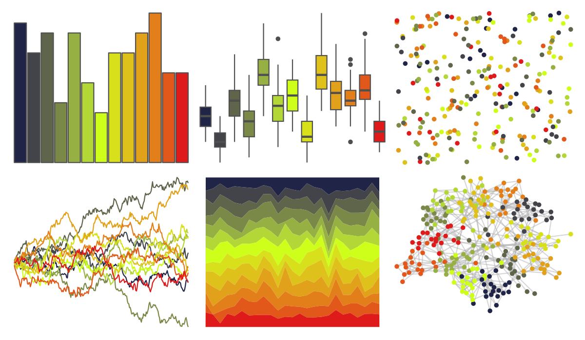

# jcolors - pal12 

::: columns
::: {.column width="50%"}

**Github**

[jaredhuling/jcolors](https://github.com/jaredhuling/jcolors)
:::

::: {.column width="50%"}

**CRAN**

Not on CRAN
:::
:::

<hr> 

Use with [paletteer](https://emilhvitfeldt.github.io/paletteer/) package:

```r
library(paletteer)
paletteer_d("jcolors::pal12")
```

Use raw:

```r
c("#202547FF", "#43444AFF", "#5F654AFF", "#7B8948FF", "#97B043FF", "#B2D736FF", "#CEFF1AFF", "#D8E01BFF", "#DFC11BFF", "#E2A11BFF", "#E37F1BFF", "#E1581AFF", "#DE1A1AFF")
``` 

 

<br>

# Related Palettes

<div class="list" style="display: grid; grid-template-columns: auto auto auto;"> <figure class="figure">
<a href="../../amerika/Dem_Ind_Rep3/"> </a>
</figure> <figure class="figure">
<a href="../../impressionist.colors/la_sieste/"> </a>
</figure> <figure class="figure">
<a href="../../palettetown/cradily/"> </a>
</figure> <figure class="figure">
<a href="../../trekcolors/breen/"> </a>
</figure> <figure class="figure">
<a href="../../ochRe/lorikeet/"> </a>
</figure> <figure class="figure">
<a href="../../RColorBrewer/RdYlGn/"> </a>
</figure> <figure class="figure">
<a href="../../ggthemes/Traffic/"> </a>
</figure> <figure class="figure">
<a href="../../jcolors/pal7/"> </a>
</figure> <figure class="figure">
<a href="../../palettetown/treecko/"> </a>
</figure> <figure class="figure">
<a href="../../PrettyCols/Rainbow/"> </a>
</figure> <figure class="figure">
<a href="../../palettetown/oddish/"> </a>
</figure> <figure class="figure">
<a href="../../palettetown/caterpie/"> </a>
</figure> 
</div>
