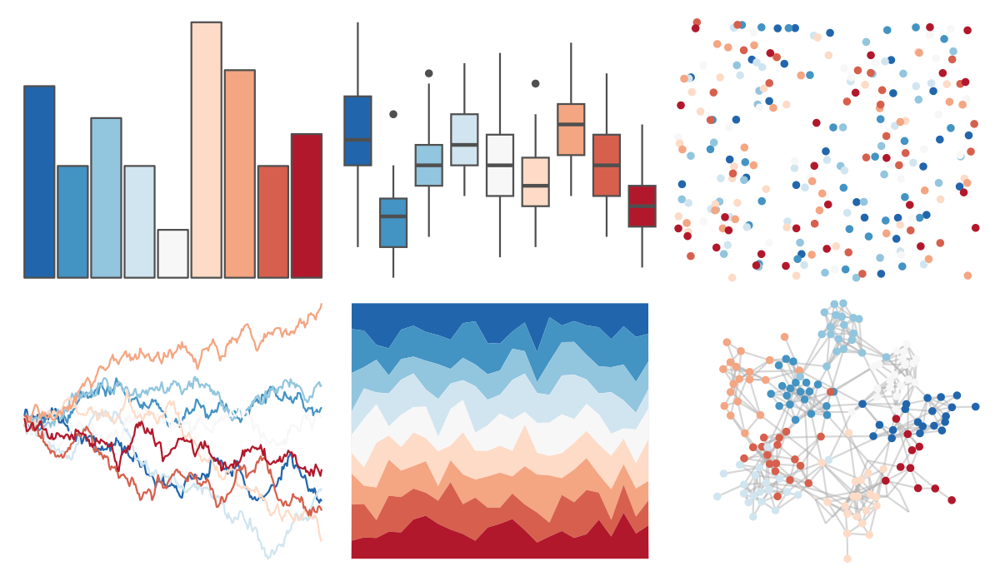
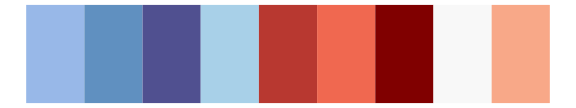

# khroma - BuRd 

::: columns
::: {.column width="50%"}

**Github**

[tesselle/khroma](https://github.com/tesselle/khroma)
:::

::: {.column width="50%"}

**CRAN**

[khroma](https://CRAN.R-project.org/package=khroma)
:::
:::

<hr> 

Use with [paletteer](https://emilhvitfeldt.github.io/paletteer/) package:

```r
library(paletteer)
paletteer_d("khroma::BuRd")
```

Use raw:

```r
c("#2166ACFF", "#4393C3FF", "#92C5DEFF", "#D1E5F0FF", "#F7F7F7FF", "#FDDBC7FF", "#F4A582FF", "#D6604DFF", "#B2182BFF")
``` 

 

<br>

# Related Palettes

<div class="list" style="display: grid; grid-template-columns: auto auto auto;"> <figure class="figure">
<a href="../../amerika/Dem_Ind_Rep3/"> </a>
</figure> <figure class="figure">
<a href="../../Redmonder/dPBIRdBu/"> </a>
</figure> <figure class="figure">
<a href="../../palettetown/phanpy/"> </a>
</figure> <figure class="figure">
<a href="../../palettetown/pupitar/"> </a>
</figure> <figure class="figure">
<a href="../../Redmonder/dPBIPuOr/"> </a>
</figure> <figure class="figure">
<a href="../../RColorBrewer/RdBu/"> </a>
</figure> <figure class="figure">
<a href="../../ggthemes/Color_Blind/"> </a>
</figure> <figure class="figure">
<a href="../../palettetown/butterfree/"> </a>
</figure> <figure class="figure">
<a href="../../palettetown/nidorina/"> </a>
</figure> <figure class="figure">
<a href="../../ochRe/namatjira_div/"> </a>
</figure> <figure class="figure">
<a href="../../NatParksPalettes/Arches/"> </a>
</figure> <figure class="figure">
<a href="../../ggthemes/Classic_Color_Blind/"> </a>
</figure> 
</div>
