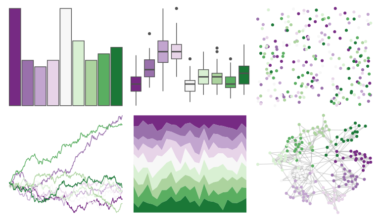

# khroma - PRGn 

::: columns
::: {.column width="50%"}

**Github**

[tesselle/khroma](https://github.com/tesselle/khroma)
:::

::: {.column width="50%"}

**CRAN**

[khroma](https://CRAN.R-project.org/package=khroma)
:::
:::

<hr> 

Use with [paletteer](https://emilhvitfeldt.github.io/paletteer/) package:

```r
library(paletteer)
paletteer_d("khroma::PRGn")
```

Use raw:

```r
c("#762A83FF", "#9970ABFF", "#C2A5CFFF", "#E7D4E8FF", "#F7F7F7FF", "#D9F0D3FF", "#ACD39EFF", "#5AAE61FF", "#1B7837FF")
``` 

 

<br>

# Related Palettes

<div class="list" style="display: grid; grid-template-columns: auto auto auto;"> <figure class="figure">
<a href="../../awtools/a_palette/"> </a>
</figure> <figure class="figure">
<a href="../../nationalparkcolors/GreatBasin/"> </a>
</figure> <figure class="figure">
<a href="../../impressionist.colors/korenveld_onder_onweerslucht/"> </a>
</figure> <figure class="figure">
<a href="../../palettetown/dratini/"> </a>
</figure> <figure class="figure">
<a href="../../RColorBrewer/PRGn/"> </a>
</figure> <figure class="figure">
<a href="../../palettetown/nidoking/"> </a>
</figure> <figure class="figure">
<a href="../../MetBrewer/Derain/"> </a>
</figure> <figure class="figure">
<a href="../../beyonce/X101/"> </a>
</figure> <figure class="figure">
<a href="../../MapPalettes/the_joker/"> </a>
</figure> <figure class="figure">
<a href="../../palettetown/heracross/"> </a>
</figure> <figure class="figure">
<a href="../../palettetown/tyranitar/"> </a>
</figure> <figure class="figure">
<a href="../../palettetown/hitmontop/"> </a>
</figure> 
</div>
