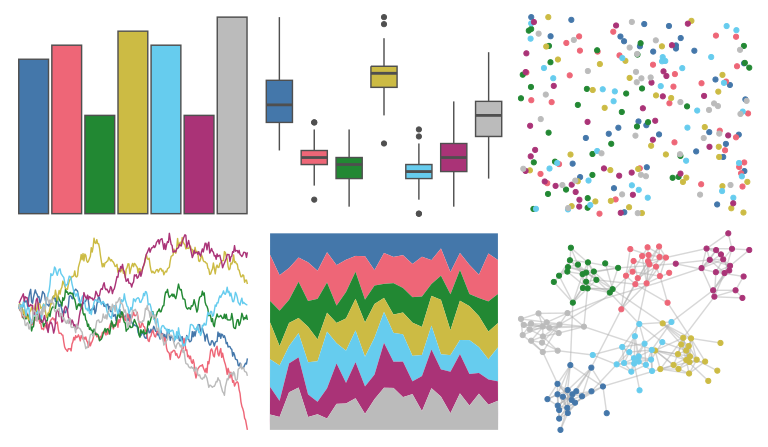

# khroma - bright 

::: columns
::: {.column width="50%"}

**Github**

[tesselle/khroma](https://github.com/tesselle/khroma)
:::

::: {.column width="50%"}

**CRAN**

[khroma](https://CRAN.R-project.org/package=khroma)
:::
:::

<hr> 

Use with [paletteer](https://emilhvitfeldt.github.io/paletteer/) package:

```r
library(paletteer)
paletteer_d("khroma::bright")
```

Use raw:

```r
c("#4477AAFF", "#EE6677FF", "#228833FF", "#CCBB44FF", "#66CCEEFF", "#AA3377FF", "#BBBBBBFF")
``` 

 

<br>

# Related Palettes

<div class="list" style="display: grid; grid-template-columns: auto auto auto;"> <figure class="figure">
<a href="../../awtools/a_palette/"> </a>
</figure> <figure class="figure">
<a href="../../lisa/MarcChagall/"> </a>
</figure> <figure class="figure">
<a href="../../lisa/JoanMiro/"> </a>
</figure> <figure class="figure">
<a href="../../unikn/pal_unikn_pref/"> </a>
</figure> <figure class="figure">
<a href="../../RColorBrewer/Accent/"> </a>
</figure> <figure class="figure">
<a href="../../lisa/PietMondrian/"> </a>
</figure> <figure class="figure">
<a href="../../lisa/JamesRosenquist/"> </a>
</figure> <figure class="figure">
<a href="../../feathers/princess_parrot/"> </a>
</figure> <figure class="figure">
<a href="../../feathers/eastern_rosella/"> </a>
</figure> <figure class="figure">
<a href="../../Redmonder/qPBI/"> </a>
</figure> <figure class="figure">
<a href="../../lisa/GustavKlimt/"> </a>
</figure> <figure class="figure">
<a href="../../Manu/Kotare/"> </a>
</figure> 
</div>
