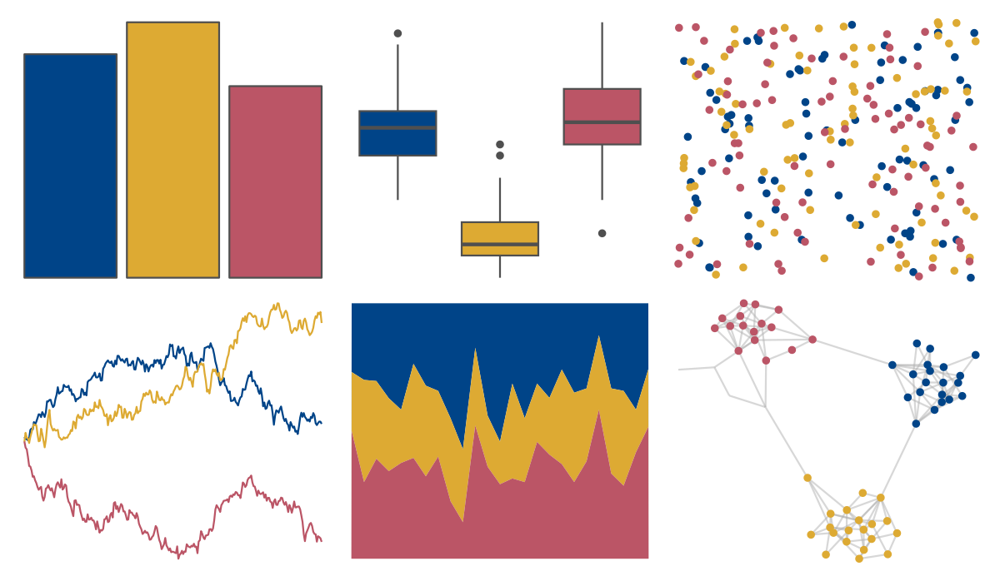

# khroma - highcontrast 

::: columns
::: {.column width="50%"}

**Github**

[tesselle/khroma](https://github.com/tesselle/khroma)
:::

::: {.column width="50%"}

**CRAN**

[khroma](https://CRAN.R-project.org/package=khroma)
:::
:::

<hr> 

Use with [paletteer](https://emilhvitfeldt.github.io/paletteer/) package:

```r
library(paletteer)
paletteer_d("khroma::highcontrast")
```

Use raw:

```r
c("#004488FF", "#DDAA33FF", "#BB5566FF")
``` 

 

<br>

# Related Palettes

<div class="list" style="display: grid; grid-template-columns: auto auto auto;"> <figure class="figure">
<a href="../../awtools/a_palette/"> </a>
</figure> <figure class="figure">
<a href="../../ButterflyColors/hamadryas_feronia/"> </a>
</figure> <figure class="figure">
<a href="../../ButterflyColors/hamadryas_feronia/"> </a>
</figure> <figure class="figure">
<a href="../../nbapalettes/pelicans/"> </a>
</figure> <figure class="figure">
<a href="../../nbapalettes/bulls_city/"> </a>
</figure> <figure class="figure">
<a href="../../nbapalettes/warriors_cny/"> </a>
</figure> <figure class="figure">
<a href="../../ltc/trio4/"> </a>
</figure> <figure class="figure">
<a href="../../nbapalettes/warriors_city/"> </a>
</figure> <figure class="figure">
<a href="../../ggthemes/wsj_dem_rep/"> </a>
</figure> <figure class="figure">
<a href="../../nbapalettes/knicks/"> </a>
</figure> <figure class="figure">
<a href="../../nbapalettes/wizards_city/"> </a>
</figure> <figure class="figure">
<a href="../../ltc/trio1/"> </a>
</figure> 
</div>
