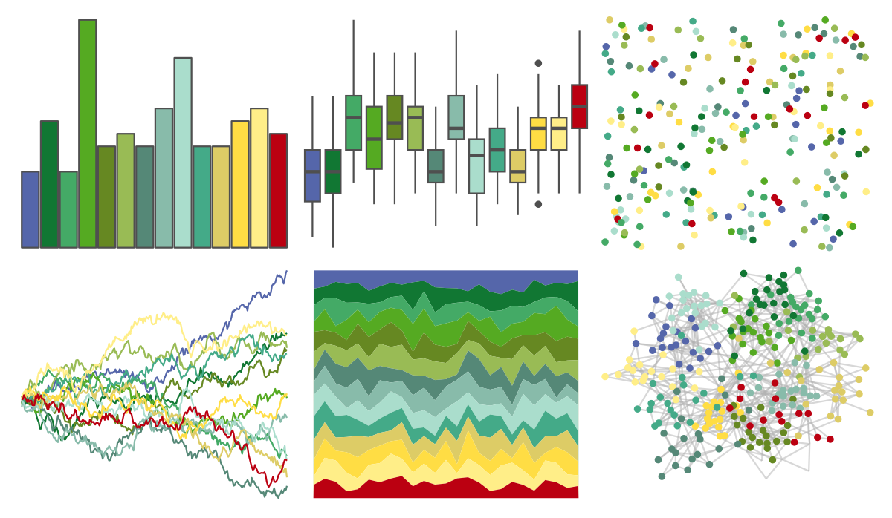

# khroma - land 

::: columns
::: {.column width="50%"}

**Github**

[tesselle/khroma](https://github.com/tesselle/khroma)
:::

::: {.column width="50%"}

**CRAN**

[khroma](https://CRAN.R-project.org/package=khroma)
:::
:::

<hr> 

Use with [paletteer](https://emilhvitfeldt.github.io/paletteer/) package:

```r
library(paletteer)
paletteer_d("khroma::land")
```

Use raw:

```r
c("#5566AAFF", "#117733FF", "#44AA66FF", "#55AA22FF", "#668822FF", "#99BB55FF", "#558877FF", "#88BBAAFF", "#AADDCCFF", "#44AA88FF", "#DDCC66FF", "#FFDD44FF", "#FFEE88FF", "#BB0011FF")
``` 

 

<br>

# Related Palettes

<div class="list" style="display: grid; grid-template-columns: auto auto auto;"> <figure class="figure">
<a href="../../awtools/a_palette/"> </a>
</figure> <figure class="figure">
<a href="../../ButterflyColors/hamadryas_feronia/"> </a>
</figure> <figure class="figure">
<a href="../../ButterflyColors/hamadryas_feronia/"> </a>
</figure> <figure class="figure">
<a href="../../tvthemes/Tyrell/"> </a>
</figure> <figure class="figure">
<a href="../../palettetown/oddish/"> </a>
</figure> <figure class="figure">
<a href="../../palettetown/bulbasaur/"> </a>
</figure> <figure class="figure">
<a href="../../palettetown/lotad/"> </a>
</figure> <figure class="figure">
<a href="../../palettetown/celebi/"> </a>
</figure> <figure class="figure">
<a href="../../palettetown/machamp/"> </a>
</figure> <figure class="figure">
<a href="../../ggthemes/Classic_Green_Orange_12/"> </a>
</figure> <figure class="figure">
<a href="../../palettetown/omanyte/"> </a>
</figure> <figure class="figure">
<a href="../../palettetown/ivysaur/"> </a>
</figure> 
</div>
