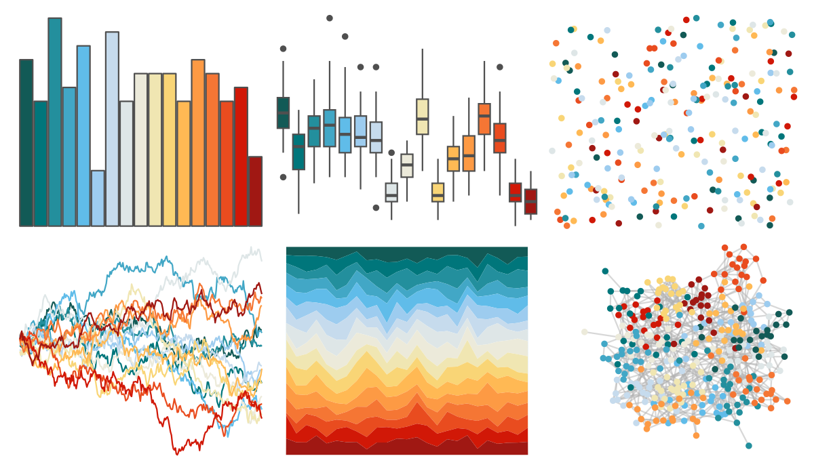
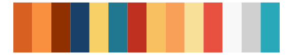

# khroma - nightfall 

::: columns
::: {.column width="50%"}

**Github**

[tesselle/khroma](https://github.com/tesselle/khroma)
:::

::: {.column width="50%"}

**CRAN**

[khroma](https://CRAN.R-project.org/package=khroma)
:::
:::

<hr> 

Use with [paletteer](https://emilhvitfeldt.github.io/paletteer/) package:

```r
library(paletteer)
paletteer_d("khroma::nightfall")
```

Use raw:

```r
c("#125A56FF", "#00767BFF", "#238F9DFF", "#42A7C6FF", "#60BCE9FF", "#9DCCEFFF", "#C6DBEDFF", "#DEE6E7FF", "#ECEADAFF", "#F0E6B2FF", "#F9D576FF", "#FFB954FF", "#FD9A44FF", "#F57634FF", "#E94C1FFF", "#D11807FF", "#A01813FF")
``` 

 

<br>

# Related Palettes

<div class="list" style="display: grid; grid-template-columns: auto auto auto;"> <figure class="figure">
<a href="../../amerika/Dem_Ind_Rep3/"> </a>
</figure> <figure class="figure">
<a href="../../palettetown/charizard/"> </a>
</figure> <figure class="figure">
<a href="../../palettetown/octillery/"> </a>
</figure> <figure class="figure">
<a href="../../palettetown/feraligatr/"> </a>
</figure> <figure class="figure">
<a href="../../palettetown/lanturn/"> </a>
</figure> <figure class="figure">
<a href="../../ggthemes/stata_s2color/"> </a>
</figure> <figure class="figure">
<a href="../../palettetown/hitmonchan/"> </a>
</figure> <figure class="figure">
<a href="../../palettetown/sneasel/"> </a>
</figure> <figure class="figure">
<a href="../../palettetown/beedrill/"> </a>
</figure> <figure class="figure">
<a href="../../palettetown/magnemite/"> </a>
</figure> <figure class="figure">
<a href="../../palettetown/surskit/"> </a>
</figure> <figure class="figure">
<a href="../../palettetown/squirtle/"> </a>
</figure> 
</div>
