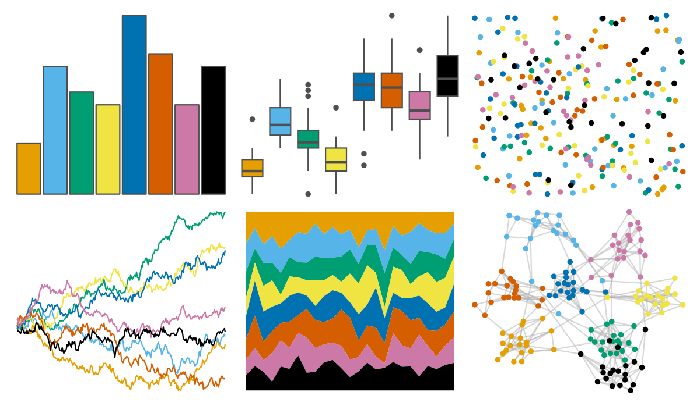

# khroma - okabeitoblack 

::: columns
::: {.column width="50%"}

**Github**

[tesselle/khroma](https://github.com/tesselle/khroma)
:::

::: {.column width="50%"}

**CRAN**

[khroma](https://CRAN.R-project.org/package=khroma)
:::
:::

<hr> 

Use with [paletteer](https://emilhvitfeldt.github.io/paletteer/) package:

```r
library(paletteer)
paletteer_d("khroma::okabeitoblack")
```

Use raw:

```r
c("#E69F00FF", "#56B4E9FF", "#009E73FF", "#F0E442FF", "#0072B2FF", "#D55E00FF", "#CC79A7FF", "#000000FF")
``` 

 

<br>

# Related Palettes

<div class="list" style="display: grid; grid-template-columns: auto auto auto;"> <figure class="figure">
<a href="../../awtools/a_palette/"> </a>
</figure> <figure class="figure">
<a href="../../ButterflyColors/hamadryas_feronia/"> </a>
</figure> <figure class="figure">
<a href="../../ButterflyColors/hamadryas_feronia/"> </a>
</figure> <figure class="figure">
<a href="../../colorblindr/OkabeIto_black/"> </a>
</figure> <figure class="figure">
<a href="../../tvthemes/bigHero6/"> </a>
</figure> <figure class="figure">
<a href="../../tvthemes/gravityFalls/"> </a>
</figure> <figure class="figure">
<a href="../../ggthemes/colorblind/"> </a>
</figure> <figure class="figure">
<a href="../../khroma/okabeito/"> </a>
</figure> <figure class="figure">
<a href="../../ltc/hat/"> </a>
</figure> <figure class="figure">
<a href="../../ltc/ten_colors/"> </a>
</figure> <figure class="figure">
<a href="../../tvthemes/spongeBob/"> </a>
</figure> <figure class="figure">
<a href="../../tvthemes/Regular/"> </a>
</figure> 
</div>
