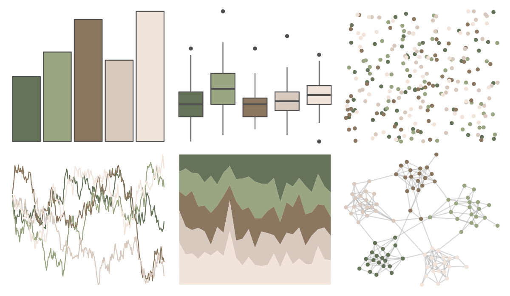
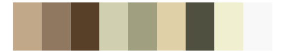

# lisa - AlbrechtDurer 

::: columns
::: {.column width="50%"}

**Github**

[tyluRp/lisa](https://github.com/tyluRp/lisa)
:::

::: {.column width="50%"}

**CRAN**

[lisa](https://CRAN.R-project.org/package=lisa)
:::
:::

<hr> 

Use with [paletteer](https://emilhvitfeldt.github.io/paletteer/) package:

```r
library(paletteer)
paletteer_d("lisa::AlbrechtDurer")
```

Use raw:

```r
c("#657359FF", "#9AA582FF", "#8B775FFF", "#D7C9BEFF", "#F1E4DBFF")
``` 

 

<br>

# Related Palettes

<div class="list" style="display: grid; grid-template-columns: auto auto auto;"> <figure class="figure">
<a href="../../awtools/a_palette/"> </a>
</figure> <figure class="figure">
<a href="../../fishualize/Anchoviella_lepidentostole/"> </a>
</figure> <figure class="figure">
<a href="../../palettetown/pinsir/"> </a>
</figure> <figure class="figure">
<a href="../../lisa/PaulKlee/"> </a>
</figure> <figure class="figure">
<a href="../../beyonce/X52/"> </a>
</figure> <figure class="figure">
<a href="../../fishualize/Oncorhynchus_tshawytscha/"> </a>
</figure> <figure class="figure">
<a href="../../fishualize/Oncorhynchus_mykiss/"> </a>
</figure> <figure class="figure">
<a href="../../calecopal/arbutus/"> </a>
</figure> <figure class="figure">
<a href="../../fishualize/Mugil_liza/"> </a>
</figure> <figure class="figure">
<a href="../../calecopal/coastaldune1/"> </a>
</figure> <figure class="figure">
<a href="../../fishualize/Esox_lucius/"> </a>
</figure> <figure class="figure">
<a href="../../beyonce/X50/"> </a>
</figure> 
</div>
