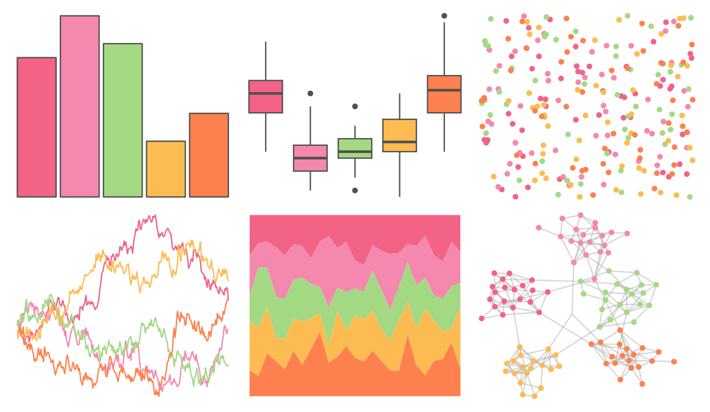

# lisa - AndyWarhol 

::: columns
::: {.column width="50%"}

**Github**

[tylerlittlefield/lisa](https://github.com/tylerlittlefield/lisa)
:::

::: {.column width="50%"}

**CRAN**

[lisa](https://CRAN.R-project.org/package=lisa)
:::
:::

<hr> 

Use with [paletteer](https://emilhvitfeldt.github.io/paletteer/) package:

```r
library(paletteer)
paletteer_d("lisa::AndyWarhol")
```

Use raw:

```r
c("#F26386FF", "#F588AFFF", "#A4D984FF", "#FCBC52FF", "#FD814EFF")
``` 

 

<br>

# Related Palettes

<div class="list" style="display: grid; grid-template-columns: auto auto auto;"> <figure class="figure">
<a href="../../amerika/Dem_Ind_Rep3/"> </a>
</figure> <figure class="figure">
<a href="../../rtist/warhol/"> </a>
</figure> <figure class="figure">
<a href="../../waRhol/marilyn_67/"> </a>
</figure> <figure class="figure">
<a href="../../rcartocolor/PinkYl/"> </a>
</figure> <figure class="figure">
<a href="../../lisa/M_C_Escher/"> </a>
</figure> <figure class="figure">
<a href="../../MoMAColors/Connors/"> </a>
</figure> <figure class="figure">
<a href="../../PrettyCols/Lucent/"> </a>
</figure> <figure class="figure">
<a href="../../rcartocolor/OrYel/"> </a>
</figure> <figure class="figure">
<a href="../../MoMAColors/ustwo/"> </a>
</figure> <figure class="figure">
<a href="../../ggthemes/Summer/"> </a>
</figure> <figure class="figure">
<a href="../../ggthemes/excel_Berlin/"> </a>
</figure> <figure class="figure">
<a href="../../lisa/CyTwombly/"> </a>
</figure> 
</div>
