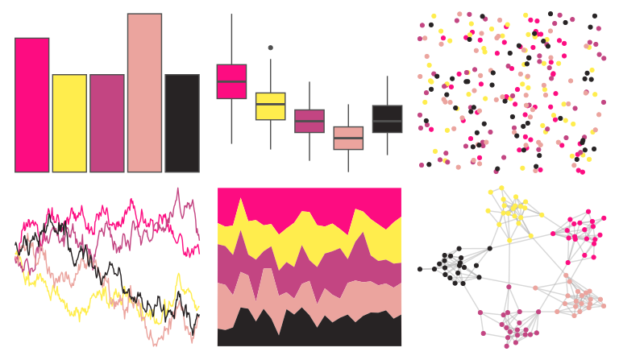

# lisa - AndyWarhol_1 

::: columns
::: {.column width="50%"}

**Github**

[tyluRp/lisa](https://github.com/tyluRp/lisa)
:::

::: {.column width="50%"}

**CRAN**

[lisa](https://CRAN.R-project.org/package=lisa)
:::
:::

<hr> 

Use with [paletteer](https://emilhvitfeldt.github.io/paletteer/) package:

```r
library(paletteer)
paletteer_d("lisa::AndyWarhol_1")
```

Use raw:

```r
c("#FD0C81FF", "#FFED4DFF", "#C34582FF", "#EBA49EFF", "#272324FF")
``` 

 

<br>

# Related Palettes

<div class="list" style="display: grid; grid-template-columns: auto auto auto;"> <figure class="figure">
<a href="../../awtools/a_palette/"> </a>
</figure> <figure class="figure">
<a href="../../tvthemes/Ruby/"> </a>
</figure> <figure class="figure">
<a href="../../trekcolors/lcars_red_alert/"> </a>
</figure> <figure class="figure">
<a href="../../tvthemes/Sunstone/"> </a>
</figure> <figure class="figure">
<a href="../../beyonce/X30/"> </a>
</figure> <figure class="figure">
<a href="../../DresdenColor/briefcases/"> </a>
</figure> <figure class="figure">
<a href="../../nationalparkcolors/Saguaro/"> </a>
</figure> <figure class="figure">
<a href="../../NineteenEightyR/sunset1/"> </a>
</figure> <figure class="figure">
<a href="../../jcolors/pal4/"> </a>
</figure> <figure class="figure">
<a href="../../palettetown/whismur/"> </a>
</figure> <figure class="figure">
<a href="../../colRoz/desert_dusk/"> </a>
</figure> <figure class="figure">
<a href="../../nationalparkcolors/Hawaii/"> </a>
</figure> 
</div>
