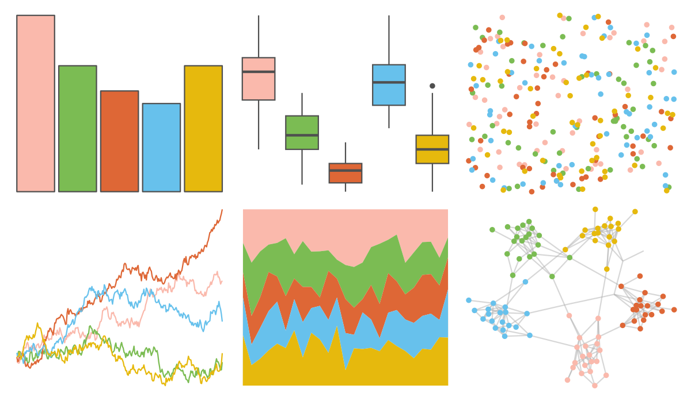

# lisa - BridgetRiley 

::: columns
::: {.column width="50%"}

**Github**

[tylerlittlefield/lisa](https://github.com/tylerlittlefield/lisa)
:::

::: {.column width="50%"}

**CRAN**

[lisa](https://CRAN.R-project.org/package=lisa)
:::
:::

<hr> 

Use with [paletteer](https://emilhvitfeldt.github.io/paletteer/) package:

```r
library(paletteer)
paletteer_d("lisa::BridgetRiley")
```

Use raw:

```r
c("#FAB9ACFF", "#7BBC53FF", "#DE6736FF", "#67C1ECFF", "#E6B90DFF")
``` 

 

<br>

# Related Palettes

<div class="list" style="display: grid; grid-template-columns: auto auto auto;"> <figure class="figure">
<a href="../../amerika/Dem_Ind_Rep3/"> </a>
</figure> <figure class="figure">
<a href="../../lisa/JackBush/"> </a>
</figure> <figure class="figure">
<a href="../../nationalparkcolors/Badlands/"> </a>
</figure> <figure class="figure">
<a href="../../lisa/JackYoungerman/"> </a>
</figure> <figure class="figure">
<a href="../../ggthemes/excel_Vapor_Trail/"> </a>
</figure> <figure class="figure">
<a href="../../fishualize/Salmo_salar/"> </a>
</figure> <figure class="figure">
<a href="../../lisa/JackBush_1/"> </a>
</figure> <figure class="figure">
<a href="../../ltc/fernande/"> </a>
</figure> <figure class="figure">
<a href="../../werpals/pan/"> </a>
</figure> <figure class="figure">
<a href="../../lisa/M_C_Escher/"> </a>
</figure> <figure class="figure">
<a href="../../poisonfrogs/Dsarayacuensis/"> </a>
</figure> <figure class="figure">
<a href="../../fishualize/Lepomis_megalotis/"> </a>
</figure> 
</div>
