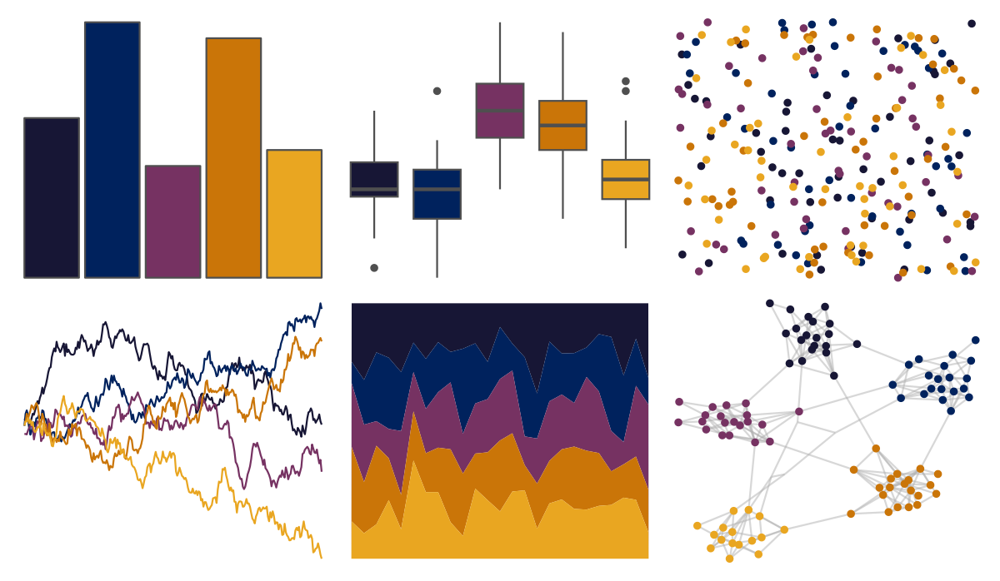

# lisa - GretchenAlbrecht 

::: columns
::: {.column width="50%"}

**Github**

[tylerlittlefield/lisa](https://github.com/tylerlittlefield/lisa)
:::

::: {.column width="50%"}

**CRAN**

[lisa](https://CRAN.R-project.org/package=lisa)
:::
:::

<hr> 

Use with [paletteer](https://emilhvitfeldt.github.io/paletteer/) package:

```r
library(paletteer)
paletteer_d("lisa::GretchenAlbrecht")
```

Use raw:

```r
c("#171635FF", "#00225DFF", "#763262FF", "#CA7508FF", "#E9A621FF")
``` 

 

<br>

# Related Palettes

<div class="list" style="display: grid; grid-template-columns: auto auto auto;"> <figure class="figure">
<a href="../../amerika/Dem_Ind_Rep3/"> </a>
</figure> <figure class="figure">
<a href="../../nbapalettes/nuggets/"> </a>
</figure> <figure class="figure">
<a href="../../nord/victory_bonds/"> </a>
</figure> <figure class="figure">
<a href="../../poisonfrogs/Opsancristobal/"> </a>
</figure> <figure class="figure">
<a href="../../nbapalettes/nuggets_statement/"> </a>
</figure> <figure class="figure">
<a href="../../NineteenEightyR/sunset3/"> </a>
</figure> <figure class="figure">
<a href="../../PrettyCols/Lively/"> </a>
</figure> <figure class="figure">
<a href="../../MetBrewer/Ingres/"> </a>
</figure> <figure class="figure">
<a href="../../NatParksPalettes/DeathValley/"> </a>
</figure> <figure class="figure">
<a href="../../PrettyCols/Dark/"> </a>
</figure> <figure class="figure">
<a href="../../ggprism/muted_rainbow/"> </a>
</figure> <figure class="figure">
<a href="../../colRoz/m_horridus/"> </a>
</figure> 
</div>
