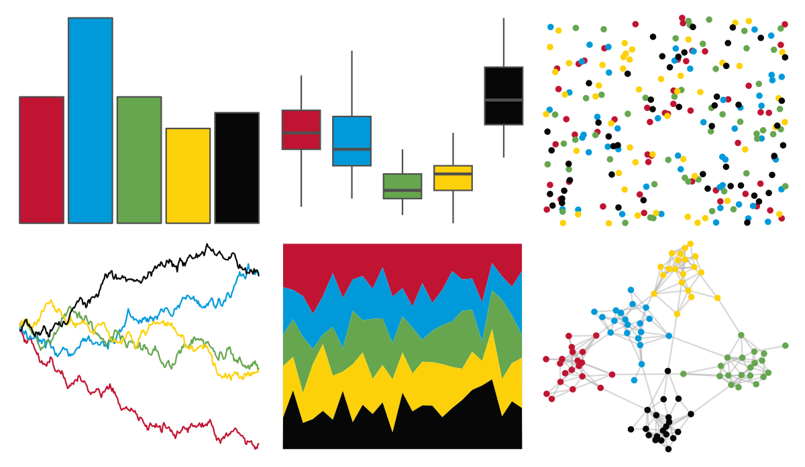

# lisa - Jean_MichelBasquiat_1 

::: columns
::: {.column width="50%"}

**Github**

[tyluRp/lisa](https://github.com/tyluRp/lisa)
:::

::: {.column width="50%"}

**CRAN**

[lisa](https://CRAN.R-project.org/package=lisa)
:::
:::

<hr> 

Use with [paletteer](https://emilhvitfeldt.github.io/paletteer/) package:

```r
library(paletteer)
paletteer_d("lisa::Jean_MichelBasquiat_1")
```

Use raw:

```r
c("#C11432FF", "#009ADAFF", "#66A64FFF", "#FDD10AFF", "#070707FF")
``` 

 

<br>

# Related Palettes

<div class="list" style="display: grid; grid-template-columns: auto auto auto;"> <figure class="figure">
<a href="../../awtools/a_palette/"> </a>
</figure> <figure class="figure">
<a href="../../nbapalettes/timberwolves_00s/"> </a>
</figure> <figure class="figure">
<a href="../../nbapalettes/supersonics_holiday/"> </a>
</figure> <figure class="figure">
<a href="../../fishualize/Aulostomus_chinensis/"> </a>
</figure> <figure class="figure">
<a href="../../nbapalettes/pacers_venue/"> </a>
</figure> <figure class="figure">
<a href="../../fishualize/Balistapus_undulatus/"> </a>
</figure> <figure class="figure">
<a href="../../fishualize/Neogobius_melanostomus/"> </a>
</figure> <figure class="figure">
<a href="../../nbapalettes/timberwolves_classic/"> </a>
</figure> <figure class="figure">
<a href="../../rockthemes/zeppelin/"> </a>
</figure> <figure class="figure">
<a href="../../wesanderson/BottleRocket2/"> </a>
</figure> <figure class="figure">
<a href="../../fishualize/Salvelinus_fontinalis/"> </a>
</figure> <figure class="figure">
<a href="../../nbapalettes/raptors_europe/"> </a>
</figure> 
</div>
