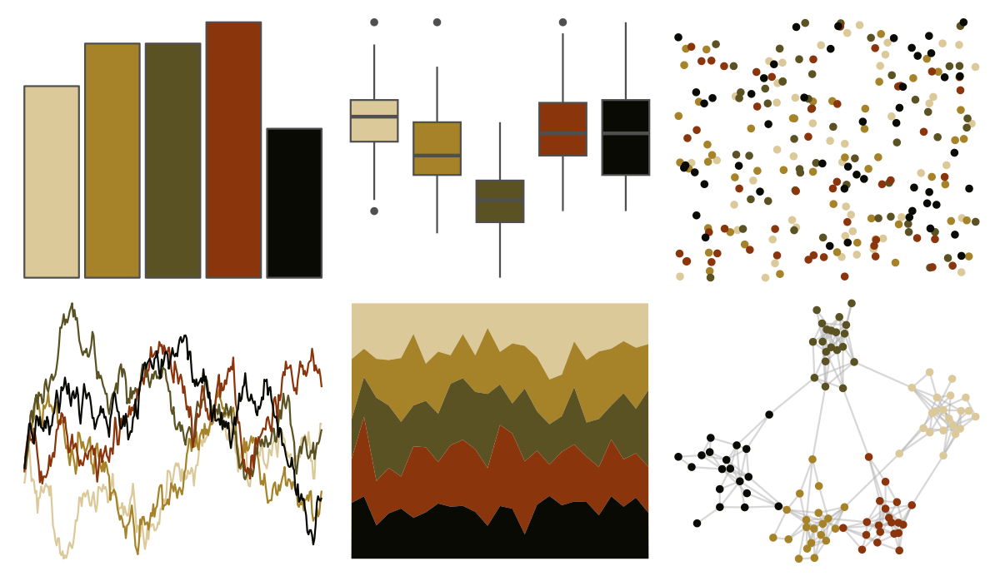

# lisa - Rembrandt 

::: columns
::: {.column width="50%"}

**Github**

[tylerlittlefield/lisa](https://github.com/tylerlittlefield/lisa)
:::

::: {.column width="50%"}

**CRAN**

[lisa](https://CRAN.R-project.org/package=lisa)
:::
:::

<hr> 

Use with [paletteer](https://emilhvitfeldt.github.io/paletteer/) package:

```r
library(paletteer)
paletteer_d("lisa::Rembrandt")
```

Use raw:

```r
c("#DBC99AFF", "#A68329FF", "#5B5224FF", "#8A350CFF", "#090A04FF")
``` 

 

<br>

# Related Palettes

<div class="list" style="display: grid; grid-template-columns: auto auto auto;"> <figure class="figure">
<a href="../../amerika/Dem_Ind_Rep3/"> </a>
</figure> <figure class="figure">
<a href="../../poisonfrogs/Ptomopterna/"> </a>
</figure> <figure class="figure">
<a href="../../feathers/superb_fairy_wren/"> </a>
</figure> <figure class="figure">
<a href="../../DresdenColor/smallfavor/"> </a>
</figure> <figure class="figure">
<a href="../../DresdenColor/changes/"> </a>
</figure> <figure class="figure">
<a href="../../colRoz/e_leuraensis/"> </a>
</figure> <figure class="figure">
<a href="../../DresdenColor/summerknight/"> </a>
</figure> <figure class="figure">
<a href="../../fishualize/Aulostomus_chinensis/"> </a>
</figure> <figure class="figure">
<a href="../../DresdenColor/sidejobs/"> </a>
</figure> <figure class="figure">
<a href="../../fishualize/Pterois_volitans/"> </a>
</figure> <figure class="figure">
<a href="../../poisonfrogs/Llineatus/"> </a>
</figure> <figure class="figure">
<a href="../../rtist/davinci/"> </a>
</figure> 
</div>
