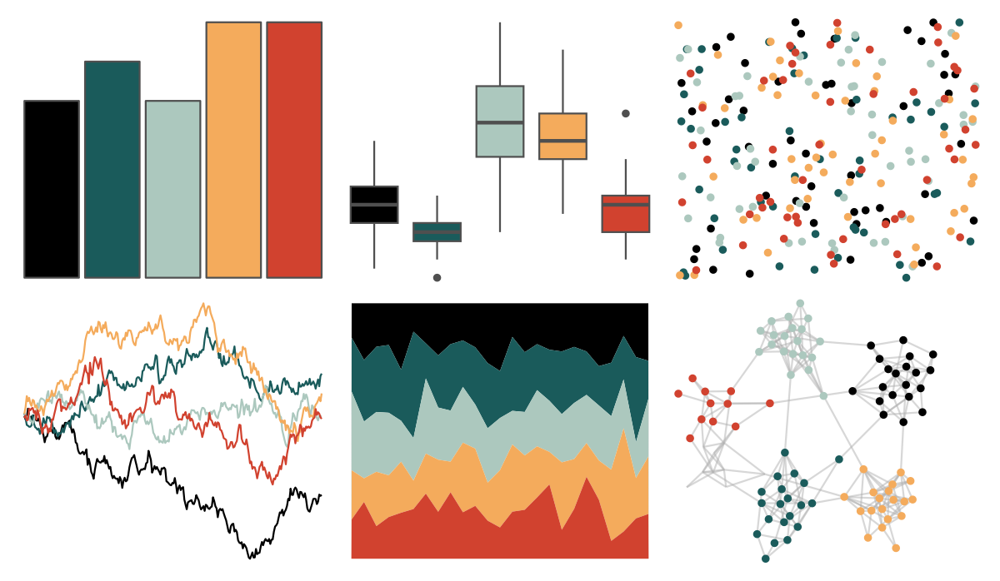

# ltc - alger 

::: columns
::: {.column width="50%"}

**Github**

[loukesio/ltc_palettes](https://github.com/loukesio/ltc_palettes)
:::

::: {.column width="50%"}

**CRAN**

Not on CRAN
:::
:::

<hr> 

Use with [paletteer](https://emilhvitfeldt.github.io/paletteer/) package:

```r
library(paletteer)
paletteer_d("ltc::alger")
```

Use raw:

```r
c("#000000FF", "#1A5B5BFF", "#ACC8BEFF", "#F4AB5CFF", "#D1422FFF")
``` 

 

<br>

# Related Palettes

<div class="list" style="display: grid; grid-template-columns: auto auto auto;"> <figure class="figure">
<a href="../../awtools/a_palette/"> </a>
</figure> <figure class="figure">
<a href="../../ButterflyColors/hamadryas_feronia/"> </a>
</figure> <figure class="figure">
<a href="../../ButterflyColors/hamadryas_feronia/"> </a>
</figure> <figure class="figure">
<a href="../../nbapalettes/knicks_city2/"> </a>
</figure> <figure class="figure">
<a href="../../fishualize/Pseudochromis_aldabraensis/"> </a>
</figure> <figure class="figure">
<a href="../../rockthemes/miles/"> </a>
</figure> <figure class="figure">
<a href="../../fishualize/Epibulus_insidiator/"> </a>
</figure> <figure class="figure">
<a href="../../tvthemes/Jasper/"> </a>
</figure> <figure class="figure">
<a href="../../rockthemes/heep/"> </a>
</figure> <figure class="figure">
<a href="../../nbapalettes/clippers_original/"> </a>
</figure> <figure class="figure">
<a href="../../fishualize/Oxymonacanthus_longirostris/"> </a>
</figure> <figure class="figure">
<a href="../../ghibli/MononokeMedium/"> </a>
</figure> 
</div>
