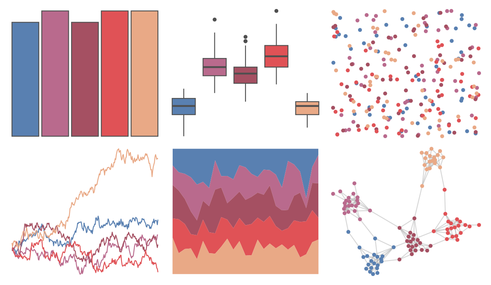

# ltc - franscoise 

::: columns
::: {.column width="50%"}

**Github**

[loukesio/ltc-color-palettes](https://github.com/loukesio/ltc-color-palettes)
:::

::: {.column width="50%"}

**CRAN**

Not on CRAN
:::
:::

<hr> 

Use with [paletteer](https://emilhvitfeldt.github.io/paletteer/) package:

```r
library(paletteer)
paletteer_d("ltc::franscoise")
```

Use raw:

```r
c("#5980B1FF", "#B96A8DFF", "#A55062FF", "#E05256FF", "#E9A986FF")
``` 

 

<br>

# Related Palettes

<div class="list" style="display: grid; grid-template-columns: auto auto auto;"> <figure class="figure">
<a href="../../amerika/Dem_Ind_Rep3/"> </a>
</figure> <figure class="figure">
<a href="../../trekcolors/lcars_2375/"> </a>
</figure> <figure class="figure">
<a href="../../lisa/PabloPicasso/"> </a>
</figure> <figure class="figure">
<a href="../../ggthemes/Classic_Blue_Red_6/"> </a>
</figure> <figure class="figure">
<a href="../../NatParksPalettes/BryceCanyon/"> </a>
</figure> <figure class="figure">
<a href="../../PrettyCols/Reds/"> </a>
</figure> <figure class="figure">
<a href="../../rcartocolor/RedOr/"> </a>
</figure> <figure class="figure">
<a href="../../PNWColors/Sunset2/"> </a>
</figure> <figure class="figure">
<a href="../../MetBrewer/Cassatt1/"> </a>
</figure> <figure class="figure">
<a href="../../colRoz/c_brevi/"> </a>
</figure> <figure class="figure">
<a href="../../MexBrewer/Ronda/"> </a>
</figure> <figure class="figure">
<a href="../../ggthemes/excel_Ion_Boardroom/"> </a>
</figure> 
</div>
