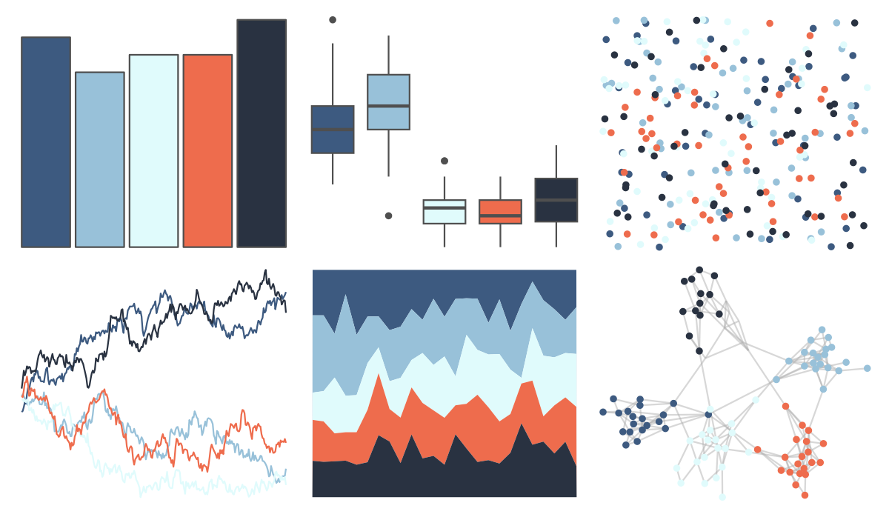

# ltc - maya 

::: columns
::: {.column width="50%"}

**Github**

[loukesio/ltc_palettes](https://github.com/loukesio/ltc_palettes)
:::

::: {.column width="50%"}

**CRAN**

Not on CRAN
:::
:::

<hr> 

Use with [paletteer](https://emilhvitfeldt.github.io/paletteer/) package:

```r
library(paletteer)
paletteer_d("ltc::maya")
```

Use raw:

```r
c("#3D5A80FF", "#98C1D9FF", "#E0FBFCFF", "#EE6C4DFF", "#293241FF")
``` 

 

<br>

# Related Palettes

<div class="list" style="display: grid; grid-template-columns: auto auto auto;"> <figure class="figure">
<a href="../../awtools/a_palette/"> </a>
</figure> <figure class="figure">
<a href="../../ButterflyColors/hamadryas_feronia/"> </a>
</figure> <figure class="figure">
<a href="../../ButterflyColors/hamadryas_feronia/"> </a>
</figure> <figure class="figure">
<a href="../../werpals/alice/"> </a>
</figure> <figure class="figure">
<a href="../../miscpalettes/dreaming/"> </a>
</figure> <figure class="figure">
<a href="../../palettetown/marill/"> </a>
</figure> <figure class="figure">
<a href="../../IslamicArt/ottoman/"> </a>
</figure> <figure class="figure">
<a href="../../nationalparkcolors/Arches/"> </a>
</figure> <figure class="figure">
<a href="../../Redmonder/qMSO12/"> </a>
</figure> <figure class="figure">
<a href="../../beyonce/X2/"> </a>
</figure> <figure class="figure">
<a href="../../PrettyCols/RedBlues/"> </a>
</figure> <figure class="figure">
<a href="../../waRhol/skull_77/"> </a>
</figure> 
</div>
