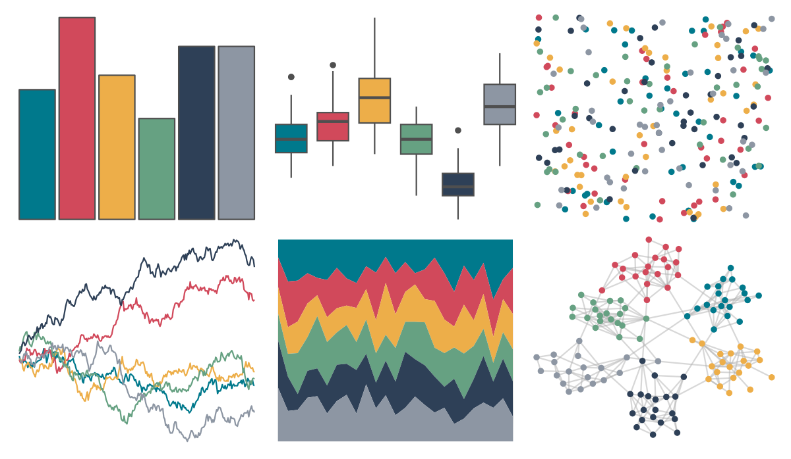

# ltc - minou 

::: columns
::: {.column width="50%"}

**Github**

[loukesio/ltc-color-palettes](https://github.com/loukesio/ltc-color-palettes)
:::

::: {.column width="50%"}

**CRAN**

Not on CRAN
:::
:::

<hr> 

Use with [paletteer](https://emilhvitfeldt.github.io/paletteer/) package:

```r
library(paletteer)
paletteer_d("ltc::minou")
```

Use raw:

```r
c("#00798CFF", "#D1495BFF", "#EDAE49FF", "#66A182FF", "#2E4057FF", "#8D96A3FF")
``` 

 

<br>

# Related Palettes

<div class="list" style="display: grid; grid-template-columns: auto auto auto;"> <figure class="figure">
<a href="../../amerika/Dem_Ind_Rep3/"> </a>
</figure> <figure class="figure">
<a href="../../ggsci/default_jama/"> </a>
</figure> <figure class="figure">
<a href="../../lisa/MarcChagall/"> </a>
</figure> <figure class="figure">
<a href="../../waRhol/skull_77/"> </a>
</figure> <figure class="figure">
<a href="../../ltc/expevo/"> </a>
</figure> <figure class="figure">
<a href="../../palettetown/startersDark/"> </a>
</figure> <figure class="figure">
<a href="../../PrettyCols/Relax/"> </a>
</figure> <figure class="figure">
<a href="../../NatParksPalettes/KingsCanyon/"> </a>
</figure> <figure class="figure">
<a href="../../nbapalettes/thunder_city/"> </a>
</figure> <figure class="figure">
<a href="../../nationalparkcolors/SmokyMountains/"> </a>
</figure> <figure class="figure">
<a href="../../Redmonder/qPBI/"> </a>
</figure> <figure class="figure">
<a href="../../PrettyCols/Celestial/"> </a>
</figure> 
</div>
