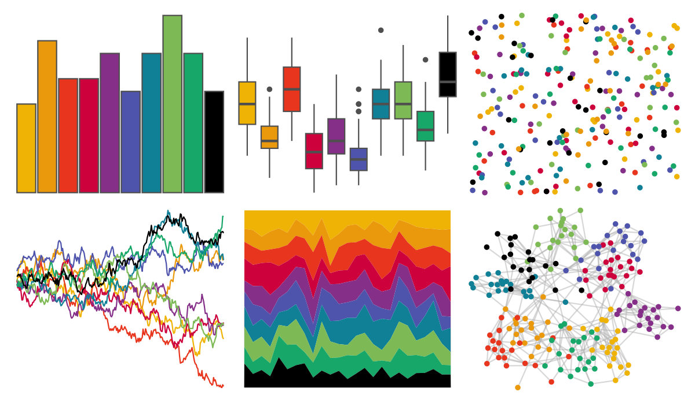

# ltc - ten_colors 

::: columns
::: {.column width="50%"}

**Github**

[loukesio/ltc-color-palettes](https://github.com/loukesio/ltc-color-palettes)
:::

::: {.column width="50%"}

**CRAN**

Not on CRAN
:::
:::

<hr> 

Use with [paletteer](https://emilhvitfeldt.github.io/paletteer/) package:

```r
library(paletteer)
paletteer_d("ltc::ten_colors")
```

Use raw:

```r
c("#EFB306FF", "#EB990CFF", "#E8351EFF", "#CD023DFF", "#852F88FF", "#4E54ACFF", "#0F8096FF", "#7DB954FF", "#17A769FF", "#000000FF")
``` 

 

<br>

# Related Palettes

<div class="list" style="display: grid; grid-template-columns: auto auto auto;"> <figure class="figure">
<a href="../../amerika/Dem_Ind_Rep3/"> </a>
</figure> <figure class="figure">
<a href="../../ltc/hat/"> </a>
</figure> <figure class="figure">
<a href="../../ggsci/lanonc_lancet/"> </a>
</figure> <figure class="figure">
<a href="../../ggthemes/few_Dark/"> </a>
</figure> <figure class="figure">
<a href="../../ggsci/default_uchicago/"> </a>
</figure> <figure class="figure">
<a href="../../tvthemes/simpsons/"> </a>
</figure> <figure class="figure">
<a href="../../nbapalettes/suns/"> </a>
</figure> <figure class="figure">
<a href="../../MoMAColors/Klein/"> </a>
</figure> <figure class="figure">
<a href="../../tvthemes/attackOnTitan/"> </a>
</figure> <figure class="figure">
<a href="../../colorblindr/OkabeIto_black/"> </a>
</figure> <figure class="figure">
<a href="../../khroma/okabeitoblack/"> </a>
</figure> <figure class="figure">
<a href="../../tvthemes/gravityFalls/"> </a>
</figure> 
</div>
