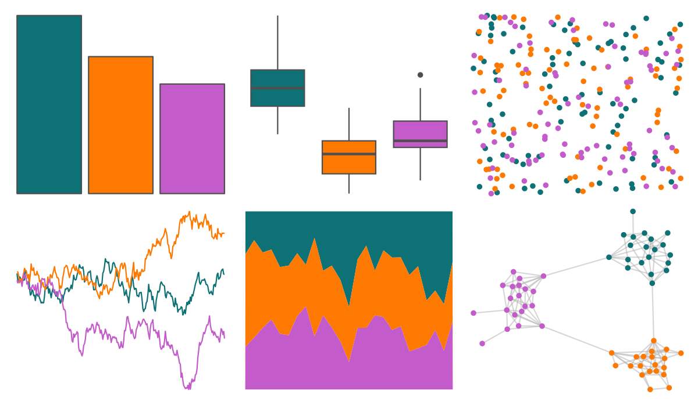

# ltc - trio1 

::: columns
::: {.column width="50%"}

**Github**

[loukesio/ltc_palettes](https://github.com/loukesio/ltc_palettes)
:::

::: {.column width="50%"}

**CRAN**

Not on CRAN
:::
:::

<hr> 

Use with [paletteer](https://emilhvitfeldt.github.io/paletteer/) package:

```r
library(paletteer)
paletteer_d("ltc::trio1")
```

Use raw:

```r
c("#0E7175FF", "#FD7901FF", "#C35BCAFF")
``` 

 

<br>

# Related Palettes

<div class="list" style="display: grid; grid-template-columns: auto auto auto;"> <figure class="figure">
<a href="../../awtools/a_palette/"> </a>
</figure> <figure class="figure">
<a href="../../ButterflyColors/hamadryas_feronia/"> </a>
</figure> <figure class="figure">
<a href="../../ButterflyColors/hamadryas_feronia/"> </a>
</figure> <figure class="figure">
<a href="../../khroma/highcontrast/"> </a>
</figure> <figure class="figure">
<a href="../../nbapalettes/knicks/"> </a>
</figure> <figure class="figure">
<a href="../../ltc/trio4/"> </a>
</figure> <figure class="figure">
<a href="../../nbapalettes/cavaliers_90s/"> </a>
</figure> <figure class="figure">
<a href="../../nbapalettes/pelicans/"> </a>
</figure> <figure class="figure">
<a href="../../ggthemes/wsj_dem_rep/"> </a>
</figure> <figure class="figure">
<a href="../../nbapalettes/bulls_city/"> </a>
</figure> <figure class="figure">
<a href="../../nbapalettes/warriors_city/"> </a>
</figure> <figure class="figure">
<a href="../../nbapalettes/bucks_00s/"> </a>
</figure> 
</div>
