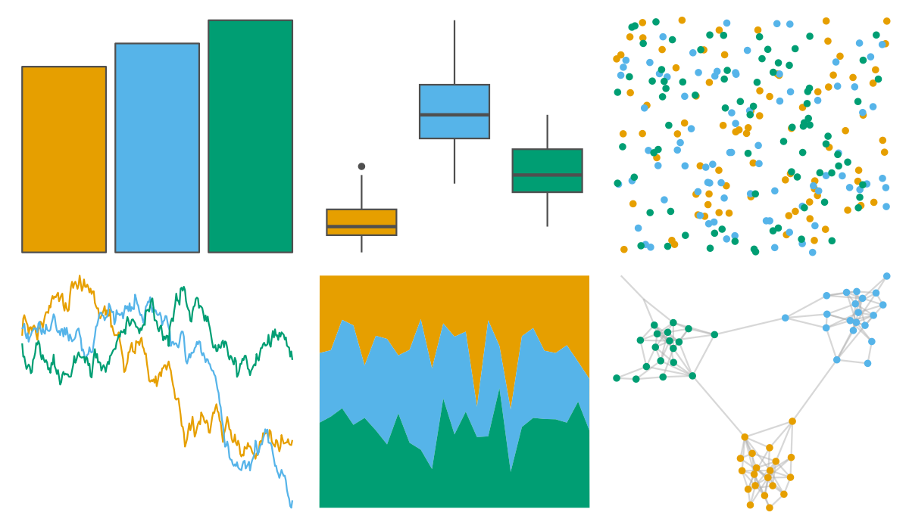

# ltc - trio3 

::: columns
::: {.column width="50%"}

**Github**

[loukesio/ltc_palettes](https://github.com/loukesio/ltc_palettes)
:::

::: {.column width="50%"}

**CRAN**

Not on CRAN
:::
:::

<hr> 

Use with [paletteer](https://emilhvitfeldt.github.io/paletteer/) package:

```r
library(paletteer)
paletteer_d("ltc::trio3")
```

Use raw:

```r
c("#E69F00FF", "#56B4E9FF", "#009E73FF")
``` 

 

<br>

# Related Palettes

<div class="list" style="display: grid; grid-template-columns: auto auto auto;"> <figure class="figure">
<a href="../../awtools/a_palette/"> </a>
</figure> <figure class="figure">
<a href="../../ButterflyColors/hamadryas_feronia/"> </a>
</figure> <figure class="figure">
<a href="../../ButterflyColors/hamadryas_feronia/"> </a>
</figure> <figure class="figure">
<a href="../../nbapalettes/celtics/"> </a>
</figure> <figure class="figure">
<a href="../../futurevisions/atomic_orange/"> </a>
</figure> <figure class="figure">
<a href="../../unikn/pal_signal/"> </a>
</figure> <figure class="figure">
<a href="../../futurevisions/atomic_blue/"> </a>
</figure> <figure class="figure">
<a href="../../ltc/trio2/"> </a>
</figure> <figure class="figure">
<a href="../../nbapalettes/pacers/"> </a>
</figure> <figure class="figure">
<a href="../../nbapalettes/hornets_city/"> </a>
</figure> <figure class="figure">
<a href="../../ggsci/alternating_igv/"> </a>
</figure> <figure class="figure">
<a href="../../nbapalettes/jazz/"> </a>
</figure> 
</div>
