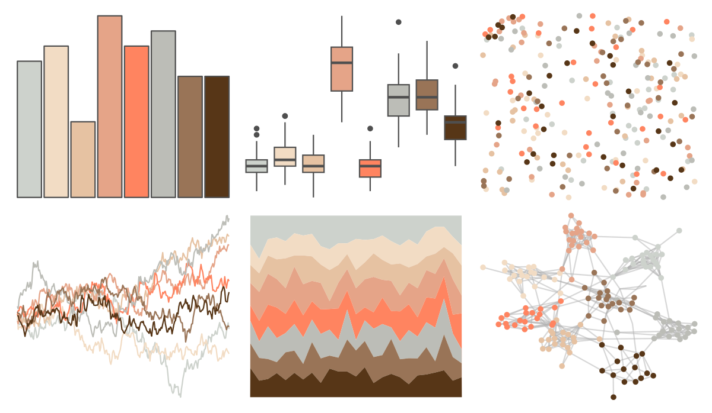
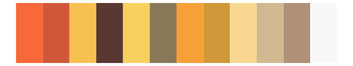

# miscpalettes - beach 

::: columns
::: {.column width="50%"}

**Github**

[EmilHvitfeldt/miscpalettes](https://github.com/EmilHvitfeldt/miscpalettes)
:::

::: {.column width="50%"}

**CRAN**

Not on CRAN
:::
:::

<hr> 

Use with [paletteer](https://emilhvitfeldt.github.io/paletteer/) package:

```r
library(paletteer)
paletteer_d("miscpalettes::beach")
```

Use raw:

```r
c("#CDD2CCFF", "#F2DCC4FF", "#E6C2A2FF", "#E5A488FF", "#FF8460FF", "#BCBDB7FF", "#997457FF", "#573617FF")
``` 

 

<br>

# Related Palettes

<div class="list" style="display: grid; grid-template-columns: auto auto auto;"> <figure class="figure">
<a href="../../amerika/Dem_Ind_Rep3/"> </a>
</figure> <figure class="figure">
<a href="../../Redmonder/qMSOYlOr/"> </a>
</figure> <figure class="figure">
<a href="../../palettetown/exeggcute/"> </a>
</figure> <figure class="figure">
<a href="../../palettetown/krabby/"> </a>
</figure> <figure class="figure">
<a href="../../beyonce/X28/"> </a>
</figure> <figure class="figure">
<a href="../../palettetown/pidgey/"> </a>
</figure> <figure class="figure">
<a href="../../palettetown/dugtrio/"> </a>
</figure> <figure class="figure">
<a href="../../trekcolors/tholian/"> </a>
</figure> <figure class="figure">
<a href="../../palettetown/kingler/"> </a>
</figure> <figure class="figure">
<a href="../../Redmonder/qMSOOr/"> </a>
</figure> <figure class="figure">
<a href="../../IslamicArt/fes/"> </a>
</figure> <figure class="figure">
<a href="../../palettetown/torchic/"> </a>
</figure> 
</div>
