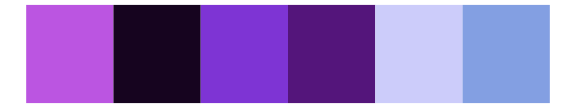

# miscpalettes - berry 

::: columns
::: {.column width="50%"}

**Github**

[EmilHvitfeldt/miscpalettes](https://github.com/EmilHvitfeldt/miscpalettes)
:::

::: {.column width="50%"}

**CRAN**

Not on CRAN
:::
:::

<hr> 

Use with [paletteer](https://emilhvitfeldt.github.io/paletteer/) package:

```r
library(paletteer)
paletteer_d("miscpalettes::berry")
```

Use raw:

```r
c("#8A2BE2FF", "#BA55D3FF", "#4169E1FF", "#C71585FF", "#0000FFFF", "#8A2BE2FF", "#DA70D6FF", "#7B68EEFF", "#C000C0FF", "#0000CDFF", "#800080FF")
``` 

 

<br>

# Related Palettes

<div class="list" style="display: grid; grid-template-columns: auto auto auto;"> <figure class="figure">
<a href="../../awtools/a_palette/"> </a>
</figure> <figure class="figure">
<a href="../../ggprism/purple_passion/"> </a>
</figure> <figure class="figure">
<a href="../../ggthemes/excel_Violet_II/"> </a>
</figure> <figure class="figure">
<a href="../../beyonce/X111/"> </a>
</figure> <figure class="figure">
<a href="../../ggprism/winter_bright/"> </a>
</figure> <figure class="figure">
<a href="../../lisa/Prince/"> </a>
</figure> <figure class="figure">
<a href="../../ggthemes/excel_Red_Violet/"> </a>
</figure> <figure class="figure">
<a href="../../ggsci/purple_material/"> </a>
</figure> <figure class="figure">
<a href="../../beyonce/X112/"> </a>
</figure> <figure class="figure">
<a href="../../beyonce/X98/"> </a>
</figure> <figure class="figure">
<a href="../../tvthemes/Sugilite/"> </a>
</figure> <figure class="figure">
<a href="../../ggprism/the_blues/"> </a>
</figure> 
</div>
